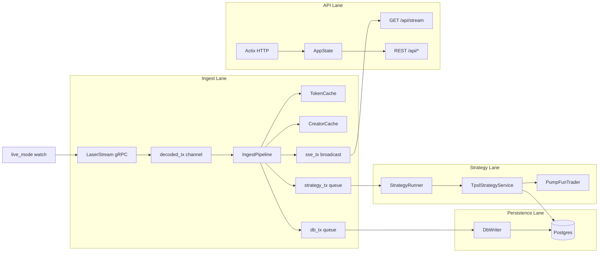

# Backend Workflow (Concise)

## Startup ([main.rs](backend/src/main.rs))

1. Load env config, init logging
2. Initialize **PumpFunTrader** (wallet, RPC, nonce accounts)
3. Connect **Postgres**, run migrations, **seed** `TokenCache` + `CreatorCache` from DB
4. Load **TpslRuntimeCache** (open positions / rules)
5. Build shared **AppState** (DB, caches, SSE broadcast, live-mode watch, SOL price, trader, TPSL cache)
6. Spawn **6 concurrent tasks** (see below)

## Runtime Architecture

## Task Breakdown

| Task | File | Role |
|------|------|------|
| **LaserStream ingest** | [client.rs](backend/src/ingest_laserstream/client.rs) | Connects to Helius LaserStream (Yellowstone gRPC), subscribes to pump program + dynamic migrated pools, reconnects with `from_slot` replay. Decodes via `adapter.rs` + `decoder/`. Pauses when `live_mode=false`. (WS `helius_ws.rs` removed — LaserStream is the sole transport.) |
| **IngestPipeline** | [pipeline.rs](backend/src/ingest_laserstream/pipeline.rs) | Hot path: decode → filter → update caches → feed reserve cache / AMM prewarm → enqueue DB writes → ping strategy → emit SSE |
| **DbWriter** | [db_writer.rs](backend/src/ingest_laserstream/db_writer.rs) | Batched async writes (tokens, trades, wallets, metrics, raw txs → `raw_transactions_grpc`) — never blocks ingest |
| **StrategyRunner** | [runner.rs](backend/src/strategies/runner.rs) | Receives `StrategyPing` per mint; delegates to TP/SL |
| **SOL price poller** | [sol_price.rs](backend/src/services/sol_price.rs) | Polls external price feed into `AppState` |
| **HTTP server** | [api/mod.rs](backend/src/api/mod.rs) | Optional (`HTTP_ENABLED`); serves dashboard + manual trades |

## Ingest Hot Path (per transaction)

1. **Decode** — [decoder/](backend/src/ingest_laserstream/decoder/) (via `adapter.rs`, which shapes the gRPC protobuf into the decoder's expected `Value`) parses into `InternalEvent`s (TokenCreated, TradeExecuted, Migrated, CreatorActivity, Liquidity)
2. **Filter** — drop events for untracked tokens (except creation)
3. **Cache update** — `TokenCache` / `CreatorCache` updated synchronously (source of truth for reads)
4. **Queue DB** — `DbWriteOp` sent to `DbWriter` (try_send, drops if full)
5. **Ping strategy** — `StrategyPing { mint, kind }` for TokenCreated / Trade
6. **SSE broadcast** — `SseEvent` to all `/api/stream` subscribers

## Strategy Lane (TP/SL)

- **TPSL services** — sibling strategies `tpsl_sniper_1/` (legacy) and
  `tpsl_sniper_2/` (scalp/continuation), each with `service.rs` + `execution/`
  ([service.rs](backend/src/strategies/tpsl_sniper_1/service.rs)):
  - `on_token_created` — evaluate rules against new token, may open position + buy via trader
  - `on_trade_executed` — check TP/SL triggers on price updates, may sell
  - Time-driven sweep exits stale positions even on silent tokens
- **TpslRuntimeCache** — in-memory holding state loaded from DB at startup
- **PumpFunTrader** (standalone [`pump-trader`](pump-trader/src/trader/) crate, re-exported via `backend/src/trader/mod.rs`) — on-chain buy/sell execution

## API Layer (read + control)

Handlers read from **AppState** (caches, DB, trader). Key groups:

- **Read**: `/api/tokens`, `/api/creators`, `/api/analysis`, `/api/positions`, `/api/strategies/tpsl1/*` + `/api/strategies/tpsl2/*`
- **Live stream**: `GET /api/stream` — SSE from ingest broadcast channel
- **Control**: `PUT /api/system/live` toggles ingestion; CRUD for TP/SL rules
- **Manual trades**: `POST /api/solana/wallet/buy|sell` — direct on-chain via trader (bypasses strategy)

## Data Stores

- **In-memory (hot)**: `TokenCache`, `CreatorCache`, `TpslRuntimeCache`, SOL price watch
- **Postgres (cold)**: tokens, trades, wallets, positions, TP/SL rules, raw transactions — written by `DbWriter`, read by API handlers and strategy service

## Key Design Choices

- **Decoupled lanes**: ingest never awaits DB or strategy; uses bounded channels with drop-on-full
- **Cache-first reads**: API and strategies read live state from caches; DB is persistence + history
- **Live mode gate**: ingest pauses without stopping the rest of the system (API still works)
