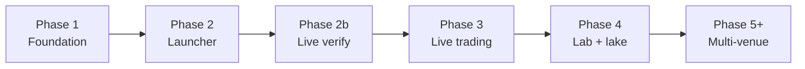

# Platform roadmap — phases & tasks

Living task list for **solana-launch-platform**. The foundation design lives in
[`and-about-the-instructions-shimmying-shore.md`](../../and-about-the-instructions-shimmying-shore.md);
ADRs in [`decisions.md`](decisions.md). Update this file when a phase advances
or tasks are added/dropped.

**Last updated:** 2026-07-06 (post bundle-landing confirmation).

---

## Phase map

| Phase | Scope | Ships to | Status |
| --- | --- | --- | --- |
| **1 — Foundation** | Schema Domains A–D, `platform-core`, 2 bins, dep partition | both | **Done** |
| **2 — Launcher** | Create, dev-buy, keystore, bundles, Jito submit | `live` / EC2 | **In progress** |
| **2b — Live verify** | Ingest round-trip, launch+bundle E2E on mainnet | `live` / EC2 | Not started |
| **3 — Live trading** | Buy/sell executor, positions, feed-based sell-confirm | `live` / EC2 | Not started |
| **4 — Lab / analysis** | `lake-export`, DuckDB, sweeps/backtests, Domain E | workstation | Stub only |
| **5+ — Growth** | Multi-launchpad, USDC quote, wallet obfuscation | both | Future |

---

## Phase 1 — Foundation ✅

- [x] Cargo workspace + path deps on `pump-trader` / `ingest-laserstream`
- [x] Two bins (`live`, `lab`) from commit 1 with dep-partition enforced
- [x] `docker-compose.yml` (Postgres + TimescaleDB, port 5556)
- [x] Migration `0001_init.sql` — Domains A–C + seeds + hypertables
- [x] Migration `0002` — Domain D (`managed_wallets`, `launch_templates`, `launches`, `bundles`)
- [x] `platform-core` — models, repos, `venue/` trait, Timescale boot
- [x] Generality proof — mock USDC + SOL tokens, same `trades`/views
- [x] `ingest-host` scaffold — pump.fun/SOL adapter + `spawn_ingest`
- [x] `lab` + `lake` scaffold — stub `lake-export`, analysis HTTP shell
- [x] `docs/decisions.md` — §9 open decisions resolved (ADR)

---

## Phase 2 — Launcher 🔄

**Goal:** Own-launch flow end-to-end on pump.fun — create → optional dev-buy →
planned sniper bundle → Jito submit.

### Done

- [x] `pump-trader::create` — `create_v1` / `create_v2` + dev-buy
- [x] Envelope keystore (ADR D3) + `wallet-encrypt` CLI
- [x] `POST /api/launches/execute` + launch failure rollback
- [x] Bundle leg composer (`leg_structures` pool → `bundles.legs`, status `planned`)
- [x] `POST /api/bundles/{id}/execute` — build signed buy txs → Jito `sendBundle`
- [x] `JITO_BLOCK_ENGINE_URL` in `.env.example` / `LauncherSettings`
- [x] **Bundle landing confirmation** — migration `0003` (`jito_bundle_id`,
  `leg_signatures`, `submitted_at`, `confirmed_at`); `launcher::confirm` watcher
  (always-on task in `live/main.rs`, 3s poll bounded to `status='submitted'`,
  90s timeout) checks leg signatures against ingested `trades` — no RPC poll;
  `landed` / `dropped` / `partial` (atomicity-anomaly) terminal states;
  `GET /api/bundles/{id}` to read status

### Todo (current focus)

- [x] **Auto-submit bundle after launch** — when template has `bundle_leg_count`,
  invoke bundle execute immediately after create lands (no second HTTP call)
- [ ] **Multi-variant bundle legs** — execute only supports `"buy"` today; wire
  `buy_exact_sol_in`, `buy_v2`, `buy_exact_quote_in` in `bundle_execute` +
  `pump-trader::bundle_buy`
- [ ] **SOL/USD poller** — update `quote_assets.usd_rate` for SOL (USDC ≈ 1.0);
  USD stays derived in views only (ADR D4)
- [ ] **`create_v1` on mainnet** — only if still required (v2 path exists)

### Crate touchpoints

| Task | Primary crate(s) |
| --- | --- |
| Auto-submit | `launcher::service`, `live::http` |
| Bundle confirm | `launcher::confirm` (done — thin `live` watcher) |
| Leg variants | `launcher::bundle_execute`, `../meme-trading/pump-trader::bundle_buy` |
| USD poller | `live` (composition root), `platform-core` repos |

---

## Phase 2b — Live verification

**Goal:** Prove the live box on real chain data before trading or lake work.

- [ ] **Ingest round-trip** — `cargo run -p live` with Helius gRPC; confirm
  `trades` rows have correct `launchpad_id`, `quote_asset_id`, `reserve_quote` /
  `reserve_base`; spot-check `trades_priced`
- [ ] **Launch + bundle E2E** — template → execute launch → auto-bundle → confirm
  sniper legs appear in ingest feed for our mint
- [ ] **Dep partition CI guard** — `cargo tree -p live` (no duckdb/arrow/parquet);
  `cargo tree -p lab` (no pump-trader/ingest-laserstream/tonic)
- [ ] **Pin borrowed crates** — path dep → pinned `git` rev on `pump-trader` /
  `ingest-laserstream` once stable

See also §8 verification checklist in the foundation design doc.

---

## Phase 3 — Live trading

**Goal:** Automated buy/sell on observed + own tokens; sell-confirm from feed.

- [ ] Trading executor in `live` (reuse `pump-trader` buy/sell/AMM paths)
- [ ] Feed-based sell-confirm (gRPC `trades` — no RPC poll; carry meme-trading lesson)
- [ ] Domain E migration — `strategy_rules`, `strategy_runs`, `strategy_positions`, …
- [ ] Strategy runner + registry (port patterns from meme-trading `live`, generalized quote/base)
- [ ] Managed-wallet roles wired — `bundler` / `treasury` / `trading` beyond launch-only
- [ ] In-RAM tracking cache + SQL-paged token list (EC2 RAM guardrails)

`live/main.rs` still notes launcher + trading as separate long-lived tasks under
`tokio::select!`.

---

## Phase 4 — Lab / analysis (workstation)

**Goal:** Cold tier + sweeps/backtests; EC2 stays a rolling PG buffer only.

- [ ] Fill `lake` crate — Parquet writer, DuckDB reader, sealed-day export
- [ ] `lake-export` implementation (replace stub in `lake::run_export`)
- [ ] Writer/reader column parity guard (`lake::schema` SSOT + test)
- [ ] PG fresh-tail union for tokens newer than last export
- [ ] `db-incremental-sync.ps1` validated against production schema drift
- [ ] Sweeps / backtests / simulate HTTP in `lab`
- [ ] Domain E analytics tables — `wallet_profiles`, `wallets`, tags (eat-bots)
- [ ] Analysis workflow cron documented — nightly sync + `lake-export --include-today`

See [`analysis-workflow.md`](analysis-workflow.md).

---

## Phase 5+ — Growth (deferred)

Recorded so they are not forgotten; no schedule.

- [ ] Multi-launchpad venue adapters (beyond pump.fun `LaunchpadAdapter`)
- [ ] USDC-quoted tokens end-to-end (quote asset row + ingest + launch)
- [ ] Wallet-funding obfuscation — `managed_wallets` funding source + hop graph (ADR §5)
- [ ] Multi-RPC health / latency hypertable (Domain F)
- [ ] Frontend SPA (`frontend-react` split live/lab — mirror meme-trading)
- [ ] AWS KMS KEK backend (replace env passphrase for keystore)
- [ ] Promote `pump-trader` + `ingest-laserstream` to shared git repo if third consumer appears

---

## Immediate next (suggested order)

1. Auto-submit bundle after launch
2. Ingest round-trip smoke test on live pump.fun feed
3. Multi-variant bundle legs (`bundle_execute` only supports `"buy"` today)

---

## How to update this file

- Check off tasks when merged; move items if scope changes.
- When **Status** in `CLAUDE.md` shifts, sync the one-line summary there.
- Deep design rationale → foundation doc or `docs/decisions.md`, not here.
