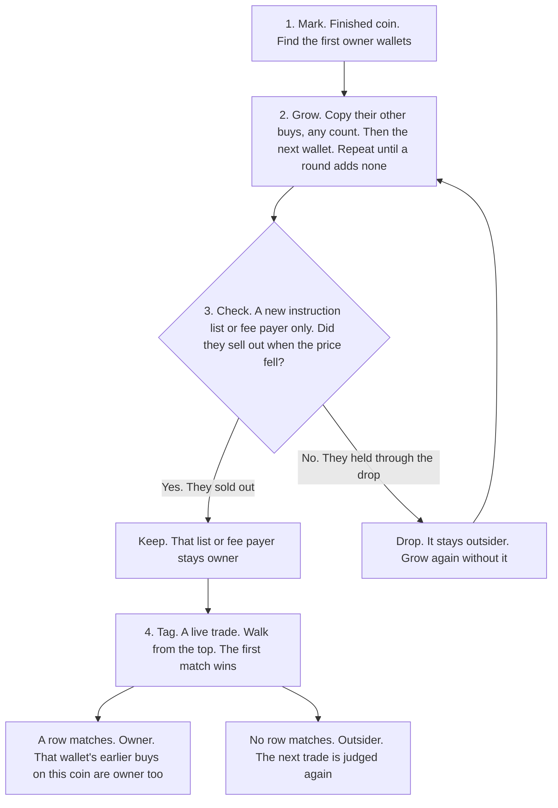

# Owner split: whose money is each trade

Every trade on a coin is **owner** or **outsider**.

- **Owner** is fake demand: the dev, the dev's wallets, and the machines the dev hires.
- **Outsider** is real money: a person or a bot trading for itself.

Owner profit, outsider buying, the dump, and the owner's decisions in
[owner-decisions.md](owner-decisions.md) stand on this split.

Names in the tables are short on purpose. Each one is spelled out in [Terms](#terms) at the end.

## At a glance

Four steps. A later step leaves an earlier answer as it stands.

**1. Mark.** The coin has ended. Find the first **owner** wallets.

**2. Grow.** Copy that wallet's other buys, at any count, and the next wallet. Repeat until a round adds nobody.

**3. Check.** Keep or drop only a new **ix structure**, **ix template**, or **fee payer** that Grow wants to reuse on other wallets. Sellers who cashed out stay **owner**. Sellers who held through the drop stay **outsider**, and Grow runs again without that one.

**4. Tag.** A live trade. Walk from row 1. The first row that matches is the answer. A match is **owner**, and that wallet's earlier buys on this coin are **owner** too. No match is **outsider**, and the next trade is judged again.

## 1. Mark

The coin has ended, so the dump is on the tape. These rules find the first **owner** wallets. No owner wallet is known yet.

### Launch

The dev's wallets sit in the transaction that creates the coin.

| Rule | Side | Why | Explanation | Example |
| --- | --- | --- | --- | --- |
| Creator | **owner** | The wallet that creates the coin is the dev. | The wallet that signs the create is **owner** on that coin. | On DdTt, the wallet that signs the create is **owner** from the first trade through the dump. |
| Same transaction | **owner** | The dev packs a helper wallet into the create. It is the same person. | Every other wallet in that create transaction is **owner** on that coin. | The DdTt create also holds a second wallet. That wallet never trades DdTt again. It is **owner** on DdTt too. |

### Birth

In the first seconds the dev buys their own coin. A real buyer is either too late to see it, or so large that the dev sells into them and the rise stops.

| Rule | Side | Why | Explanation | Example |
| --- | --- | --- | --- | --- |
| Instant buy | **owner** | A real buyer cannot see the coin 15 ms after it is created. That buy is the dev. | A buy within **15 ms** of the create is **owner**. Size and **ix structure** are ignored. | A buy lands 10 ms after the create, in the creation slot, through a public `Pump.Fun: BUY`. That buy and that wallet are **owner** on this coin. |
| Creation slot | **owner** | Apps show the coin only after the creation slot. A buy inside that slot is the dev filling the launch. | A later buy in the creation slot is **owner** when the wallet is under the sniper counts in the next row. | A buy lands later in the same slot as the create. The wallet has opened 6 coins in two weeks. The buy is **owner**. |
| Sniper | **outsider** | This bot opens many launches from many creators. It hunts the market. It is not running this coin. | A bot that buys the opening of **20** or more coins, from **10** or more creators, with at most **20%** of them in this **launch group**, over two weeks, is **outsider**. | A bot buys the creation slot of 40 coins in two weeks, from 15 creators. Only 2 of those coins are this launch group. Those buys stay **outsider**. |
| Rise continues | **owner** | The dev plants a big early buy that looks like a sniper, then keeps buying. A real buy that large is the profit the dev sells into. | A big buy in the first seconds after the creation slot is **owner** when the creator buys again after it. The **ix structure** is ignored. | On DdTt, slot 453178755, 1.5 s after the create, two buys of 1.66 SOL and 1.48 SOL use `AdvanceNonceAccount`, `Axiom Trade: ix#05`, `Axiom Trade: ix#00`, `Transfer`. The creator buys again after them and the coin rises to 78.6 SOL. Those buys are **owner**. |
| Rise stops | **outsider** | The dev sells into a big early buy and the rise ends. That buyer was real money. | A big buy the creator sells into is **outsider**. | A 2 SOL buy lands 2 s after the create. The creator sells into it and the rise ends. That buy is **outsider**. |

### Bundle

The dev sells from many wallets in one transaction, so the dump looks like a crowd.

| Rule | Side | Why | Explanation | Example |
| --- | --- | --- | --- | --- |
| Several sells | **owner** | One person packed those sells. Real sellers each land in their own transaction. | Two or more Pump.fun sells in one transaction are one person. Every wallet in it is **owner**, and each wallet's earlier buys on this coin are **owner** too. Two sells or ten is the same. | One transaction holds 12 `Pump.Fun: SELL` from 12 wallets, plus a SOL transfer and a compute-budget instruction. All 12 wallets are **owner** on this coin, including the buys they made earlier here. One sell in a transaction stays unmatched. |

### Repeat

The dev's volume is one **ix structure**, many times, from many wallets. One person repeating their own list is a trader.

| Rule | Side | Why | Explanation | Example |
| --- | --- | --- | --- | --- |
| Dominates | **owner** | The dev's script is a large share of this coin while that script is active. | The **ix structure** plus its CU price is at least **20%** of the trades, or **20%** of the SOL, from its first trade on this coin to its last, with at least **10** trades. Sniper buys in the creation slot are left out of the share. Every wallet that uses it here is **owner**, including a wallet that uses it once. A public app takes the same test. | One ix structure plus its CU price trades 40 times between its first trade and its last. Those 40 are 25% of the trades in that stretch. A wallet that used it once, in the middle of the climb, is **owner** on this coin. |
| Many wallets | **owner** | The dev rotates wallets through one script so the volume looks like a crowd. | The same **ix structure** trades **20** or more times from more than one wallet. CU price is ignored. | On 8AB1, `Axiom Trade: ix#05`, `Axiom Trade: ix#00`, `Transfer` trades 97 times from 94 wallets, from soon after launch through the 78.2 SOL peak. All 94 wallets are **owner** on 8AB1. |
| One wallet | **outsider** | One person trading their own size many times is a trader. The dev spreads the same list across wallets. | One wallet using an **ix structure** 20 times stays **outsider**. | omego trades 20 times on one coin, almost all through one ix structure or his program `bDZu`. One wallet, so those trades stay **outsider**. |

### Script

The dev's **ix structure** shows up mostly on this launch group's coins, from more than one creator wallet.

| Rule | Side | Why | Explanation | Example |
| --- | --- | --- | --- | --- |
| Mostly here | **owner** | The dev reuses one script on their own launches. A new wallet on that script is the same dev. | **30%** or more of this **ix structure**'s trades sit on this launch group's coins, on at least **5** of those coins, from at least **2** creators. CU price is ignored. One trade marks the wallet **owner**. | An ix structure has 100 trades in the market. 40 sit on this launch group's coins, across 6 coins and 3 creators. A new wallet that uses it once is **owner**. |

### Wake

When the tape goes quiet, the dev buys with the same **ix structure** to make the coin look alive.

| Rule | Side | Why | Explanation | Example |
| --- | --- | --- | --- | --- |
| After silence | **owner** | The dev restarts a dead tape. A person clicks once. The dev repeats the same list. | The same **ix structure** is bought **5** or more times, and the first of those buys ends **2 seconds** with no trade. The buys can come from one wallet or from several. Wallets that buy it more than once are **owner**, including their earlier buys of it. | The coin has no trade for 2.4 s. Then one ix structure is bought 5 times by two wallets, and each wallet buys it more than once. Both wallets are **owner** on this coin. |
| Used once | **outsider** | One buy after a pause is a person clicking. | A wallet that buys that **ix structure** only once stays **outsider**, and that buy stays out of the count of 5. | A third wallet buys the same ix structure once inside that stretch. That wallet stays **outsider**. |

### Hidden

The dev moves tokens from one wallet to another with no buy and no sell. The **token bag** is buys minus sells. A transfer is not a trade, so the bag ignores it, and the sell shows tokens the wallet never bought.

| Rule | Side | Why | Explanation | Example |
| --- | --- | --- | --- | --- |
| Below zero | **owner** | The dev sent tokens to this wallet off the tape, then this wallet sold them. | A sell that takes the token bag below zero, by more than **1%** of the sell, is **owner** on that coin. The same sell on **2** coins marks the wallet on its other coins. | A wallet sells 1,000 tokens and bought none on the tape. The bag goes to -200. The wallet is **owner** here. The same gap on a second coin marks it on the other coins it trades. |
| Never sells | **owner** | This wallet's job is to create demand. It buys and never takes profit. | A wallet with **10** or more coins, **20** or more buys, and no sell anywhere is **owner** on every coin it buys. | A wallet buys 12 coins, 25 buys, and has no sell on any coin. It is **owner** on all 12. |
| Matching holder | **owner** | The wallet still holding the missing tokens is the one that sent them. | A wallet sells tokens it never bought, so the bag goes below zero. Exactly one other wallet on this coin holds that same amount, within **0.5%**. That holder is **owner** too. | B sells 1,000 tokens and bought none. A still holds 1,000. No other wallet holds about 1,000. A sent the tokens to B with no trade. A is **owner**. |
| Bag balances | **outsider** | This seller bought the tokens on the tape. There is no hidden send to find. | The seller bought these tokens on this coin, then sold them. The bag ends at zero or above. The seller stays **outsider**. | B buys 1,000 tokens here and sells 1,000. The bag ends at 0. B stays **outsider**. |

### Loyal

The dev's wallets trade this launch group and little else. Brand-new wallets that all cash out in one moment are the dev leaving.

| Rule | Side | Why | Explanation | Example |
| --- | --- | --- | --- | --- |
| Stays in group | **owner** | A real trader's coins are spread across the market. This wallet lives on this dev's launches. | **3** or more launch-group coins, and **80%** or more of the wallet's coins are in the **launch group**. The wallet is **owner** on every coin it trades. | A wallet trades 8 coins and 7 are this launch group. It is **owner** on all 8. The 8th coin is outside the launch group, and it is still **owner** because this wallet is. |
| Fresh cash-out | **owner** | The dev cashes out through new wallets in one moment, then abandons them. | A fresh wallet has traded **4** coins or fewer in the whole market. **3** or more of them each sell their whole bag in the **same slot**, then never buy this coin again. They are **owner**, and so are their earlier buys here. | Three wallets have each traded only 3 coins ever. In one slot, each sells every token it holds on this coin, and none buys this coin again. All three are **owner**, including the buys they made here before that sell. |
| Wide service | **outsider** | A hired service works many devs, so its coins are spread out and its wallets are old. | A volume service that trades many devs' coins is too wide for the 80% test, and its wallets are above the fresh-wallet count. Loyal leaves it **outsider**. | A volume service trades hundreds of creators. Its share of this launch group is far under 80%, and its wallets have traded far more than 4 coins. Loyal leaves those trades **outsider**. |

## 2. Grow

Starts from wallets Mark named. Follow that wallet's other buys, then the next wallet. Repeat until a round adds nobody.

### Backfill

A wallet already named **owner** bought earlier on this coin. Those buys are the same dev, at any count.

| Rule | Side | Why | Explanation | Example |
| --- | --- | --- | --- | --- |
| Earlier buys | **owner** | The buy that built the bag is the same dev as the later sell. | A marked wallet's buys on this coin are **owner**. | On DdTt the sell ix structure `AdvanceNonceAccount`, `Axiom Trade: ix#00`, `Transfer` is already **owner**. The same wallets bought at slot 453178755. Those earlier buys are **owner**. |
| Their ix structure | **owner** | The dev's own buy script stays the dev's script on this coin. The 20-trade test is for wallets not yet known. | The **ix structure** on those buys is **owner** on this coin. Any count is enough. | Those buys use `AdvanceNonceAccount`, `Axiom Trade: ix#05`, `Axiom Trade: ix#00`, `Transfer`. It trades 3 times. The count is under 20, and the ix structure is still **owner** on DdTt. |

### Spread

A known dev wallet points at the next wallet. They share one transaction, a private **ix template**, a fixed time after creation, or the **fee payer**.

| Rule | Side | Why | Explanation | Example |
| --- | --- | --- | --- | --- |
| Beside an owner | **owner** | Two wallets in one transaction are one person. | A wallet in the **same transaction** as an **owner** wallet is **owner** on this coin. | A is already **owner**. One transaction holds A's sell and B's sell. B is **owner** on this coin. |
| Kept template | **owner** | The dev keeps one private tool shape. The next wallet on that shape is the same dev. | **5** or more of this dev's wallets use one **ix template**. Of its trades, **80%** are on **this dev's coins** and **95%** are trades those wallets already made. The next wallet that uses it once is **owner**. One extra wallet on fewer than **100** coins in the month can use it too. | One Axiom ix template is used 100 times. 75 times are this dev's wallets on this dev's coins. 20 times are this dev's wallets on other coins. 5 times are other people on this dev's coins. The coin count is 80 (75+5). The wallet count is 95 (75+20). Five of this dev's wallets use it. Wallet B uses it once. B is **owner**. |
| On a timer | **owner** | The dev's script fires at a set age of the coin. A person does not hit that same second on most coins. | The first trade of this **ix template** lands within **1 s** of its usual time after creation, on **60%** of its coins. The next wallet is **owner**. The same mark applies when half its wallets already use another owner **ix template**. | The first trade is about 30 s after creation. On 6 of 10 coins it lands within 1 s of 30 s. A new wallet trades it at 30.4 s and is **owner**. |
| Fee payer | **owner** | The dev pays the fee for many wallets from one account. That account reveals every wallet it pays for. | The **fee payer** spends **80%** or more of what it pays on **this dev's coins**, and it pays on fewer than **50** coins a day. Every wallet it pays is **owner**. One trade is enough. | One fee payer pays the fee for 30 wallets. 85% of that is on this dev's coins, across 20 coins a day. A new wallet uses it for one buy and is **owner**. |
| Service payer | **outsider** | A public app pays the fee for thousands of strangers. The payer is the app. | A **fee payer** that pays the fee for thousands of different people leaves those wallets **outsider**. | One fee payer pays trades on 4,000 coins a day for thousands of users. A wallet that uses it for one buy stays **outsider**. |
| First trade | **owner** | The dev opens a quiet wallet. Its first trade is already the dev's tool, on the dev's coin. | The wallet has no trade for **14** days. Its first trade is on **this dev's coins**, through an owner **ix structure**, **ix template**, or **fee payer**. That wallet is **owner**. | A wallet has no trade for 14 days. Its first trade is a buy on one of this dev's coins, and this dev's fee payer pays the fee. That wallet is **owner**. |

### Stop

A round finds no new wallet, **ix structure**, **ix template**, or **fee payer**. Grow ends.

## 3. Check

Only a new **ix structure**, **ix template**, or **fee payer** that Grow wants to reuse on other wallets. The dev sells out when the price falls. A seller who holds through the drop is real money. The numbers are [C1 and C2](#checks).

### Stay

Mark's answers, and a script copied from a wallet already **owner** on this coin, stay **owner**.

| Rule | Side | Why | Explanation | Example |
| --- | --- | --- | --- | --- |
| Mark's answers | **owner** | Mark already watched the whole coin, including the dump. Asking again would drop dev buys that are real. | Launch, Birth, Bundle, Repeat, Script, Wake, Hidden, and Loyal stay **owner**. | Repeat names the 97-trade Axiom ix structure on 8AB1. Check leaves that answer as it stands. It stays **owner**. |
| This coin | **owner** | The wallet is already the dev. Its buy script on this coin is the dev's script at any count. | An **ix structure** Grow copies from a marked wallet stays **owner** on that coin at any count. | Grow copies the 3-trade Axiom buy ix structure on DdTt from wallets already **owner**. Check leaves the 20-trade test for other wallets. It stays **owner** on DdTt. |

### Test

Did those sellers cash out on the way down. A set is one ix structure, one ix template, one fee payer, or the wallets one rule added.

| Rule | Side | Why | Explanation | Example |
| --- | --- | --- | --- | --- |
| Cashed out | **owner** | The dev sells out when the price falls. They take the profit and leave a small bag. | The set stays **owner** when **40%** or less of its sold tokens are sold after the **big drop** starts, and **10%** or less of its biggest bag is left at the end of that drop, on **60%** of at least **5** coins with a drop. A sell while that drop is still under halfway counts as early. A set with no sells passes the first half. | On 8 coins with a drop, the wallets sell on the way down and hold under 10% of the bag at the bottom, on 5 of the 8. The ix structure stays **owner**. |
| Too few coins | **owner** | There are too few dumps to judge the exit. Leave it until more coins exist. | Fewer than **5** coins with a drop. Check leaves the set **owner** and untested. | A fee payer shows up on 2 coins. It stays **owner** until more coins exist. |
| Held the bag | **outsider** | These sellers held through the drop. That is a real buyer, or a bot that did not get out. | The sellers still hold most of the bag after the drop, so that **ix structure**, **ix template**, or **fee payer** is **outsider**. Grow runs again without it. | The wallets that use this Axiom ix structure still hold most of the bag after the drop, on most of their coins. It is **outsider**, and Grow continues without it. |

## 4. Tag

A trade on a coin that is still running. Walk from row 1. The first row that matches is the answer. Rows under it are left unread.

### Follow

The buy that built the bag is the same dev as the trade that just matched.

| Rule | Side | Why | Explanation | Example |
| --- | --- | --- | --- | --- |
| Earlier buys | **owner** | The chart's buy and the later sell are the same money. | The wallet's earlier buys on this coin become **owner**. | Row 6 marks a wallet **owner** because it sits in a 12-sell transaction. The buy that wallet made 30 s earlier on this coin becomes **owner** too. |
| That ix structure | **owner** | Those buys used the dev's script. Later uses of it on this coin are the dev, at any count. | The **ix structure** those buys used becomes **owner** on this coin. Any count is enough. | Those earlier buys use an ix structure that has traded 3 times. That ix structure becomes **owner** on this coin, so the buy and the later sell move together. |

A trade that matches no row leaves the wallet free. Its next trade walks the rows again.

### First

Rows 1 to 4. The launch and the first seconds. Same human reasons as Launch and Birth.

| Rule | Side | Why | Explanation | Example |
| --- | --- | --- | --- | --- |
| 1. Creator | **owner** | The wallet that creates the coin, and any wallet packed into that transaction, is the dev. | The creator, or any wallet in the create transaction. | The wallet that signs the create, and a second wallet inside that same transaction, are **owner**. |
| 2. Instant buy | **owner** | A real buyer cannot see the coin 15 ms after it is created. | A buy within **15 ms** of the create. The wallet stays **owner** on this coin. | A buy 10 ms after the create, through a public `Pump.Fun: BUY`, is **owner**, and that wallet's later trades here are **owner**. |
| 3. Creation slot | **owner** | A buy inside the creation slot, before apps show the coin, is the dev filling the launch. | A later buy in the creation slot by a wallet under the sniper counts. | A buy later in the create's slot, from a wallet that has opened 6 coins in two weeks, is **owner**. |
| 4. Big early buy | **owner** | The dev plants a big early buy, then keeps buying. A buy the dev sells into is real money. | A big buy in the first seconds after the creation slot, once the creator has bought again after it. A buy the creator sells into stays unmatched. | On DdTt, 1.66 SOL and 1.48 SOL land 1.5 s after the create. The creator buys again and the coin rises to 78.6 SOL. Those buys become **owner**. A 2 SOL buy the creator sells into stays **outsider**. |

### Known

Rows 5 and 6. A script already kept, or sells packed into one transaction.

| Rule | Side | Why | Explanation | Example |
| --- | --- | --- | --- | --- |
| 5. Known shape | **owner** | This instruction list or tool shape was already kept for this dev. A new wallet on it is the same dev. | An **ix structure** or **ix template** Mark, Grow, or Check kept, including on a new wallet's first trade. | A private program kept by Script, or an ix template Check kept because its sellers cashed out. One trade is **owner**. |
| 6. Bundled sells | **owner** | One person packed those sells so the dump looks like a crowd. | Two or more `Pump.Fun: SELL` in this transaction. Every wallet in it is **owner** on this coin. | 12 sells in one transaction. All 12 wallets are **owner**, including buys they already made on this coin. |

### Wallet

Rows 7 to 12. The bag, the fee payer, a wallet already named.

| Rule | Side | Why | Explanation | Example |
| --- | --- | --- | --- | --- |
| 7. Below zero | **owner** | This wallet sold tokens it never bought. The dev sent them in with no trade. | This sell takes the token bag on this coin below zero. Later trades of this wallet on this coin are **owner**. | The wallet sells 1,000 tokens after buying none here. This sell is **owner**, and the next trade of this wallet here is **owner**. |
| 8. Buy-only | **owner** | This wallet only buys. Its job is demand, and it never takes profit. | The wallet has **10** coins, **20** buys, and no sell anywhere. | A wallet with 12 coins and 25 buys and no sell is **owner** on this trade. |
| 9. Fee payer | **owner** | This account pays the fee for the dev's wallets. | The **fee payer** is one Check kept. | The payer pays this trade. 85% of what it pays is on this dev's coins, on under 50 coins a day. This trade is **owner**. |
| 10. Known wallet | **owner** | This wallet was already named the dev on this coin. | This wallet is already **owner** on this coin. | Any later trade of a wallet Mark, Grow, or an earlier row named. |
| 11. Beside an owner | **owner** | Two wallets in one transaction are one person. | This transaction also contains an **owner** wallet. | Wallet B sells in the same transaction as wallet A, and A is already **owner**. B is **owner**. |
| 12. Fresh cash-out | **owner** | New wallets all empty in one moment. That is the dev leaving. | A fresh wallet has traded **4** coins or fewer in the whole market. It sells its whole bag in a slot where **2** or more other fresh wallets do the same. From that sell on, the wallet is **owner**. | Three wallets have each traded only 3 coins ever. In one slot, each sells its whole bag. Those sells are **owner**. |

### Coin

Rows 13 to 16. What this coin has shown so far. Same tests as Repeat and Wake, read up to this trade.

| Rule | Side | Why | Explanation | Example |
| --- | --- | --- | --- | --- |
| 13. Dominates | **owner** | This script is a large share of the coin from its first trade through this one. | This **ix structure** plus its CU price has at least **10** trades, and **20%** of the trades or SOL from its first trade through this one. A public app takes the same test. | From its first trade through this one, the ix structure is 40 trades and 25% of the trades in that stretch. This trade, and the wallets using it here, are **owner**. |
| 14. Many wallets | **owner** | The dev rotates wallets through one script. One wallet repeating itself is a trader. | This **ix structure** has **20** trades on this coin from more than one wallet. CU price is ignored. | On 8AB1, `Axiom Trade: ix#05`, `Axiom Trade: ix#00`, `Transfer` reaches 20 trades and the trades come from a second wallet. Those trades are **owner**. omego's 20 trades from one wallet stay unmatched, so they stay **outsider** until another row matches. |
| 15. After silence | **owner** | The dev restarts a dead tape by repeating one script. One buy after a pause is a person. | Wallets that each bought one **ix structure** more than once have **5** or more such buys, and the first followed **2 seconds** with no trade. A wallet that bought it once stays **outsider**. | The tape is quiet 2.4 s, then two wallets buy one ix structure five times between them, each more than once. Those wallets are **owner**. A one-time buyer in the same stretch stays **outsider**. |
| 16. Anyone else | **outsider** | No dev sign matched. One normal trade stays real money until a later trade says otherwise. | No row above matched. | A sniper, a button-size buy, or one normal trade. This trade is **outsider**, and the wallet is judged again on its next trade. |

In the engine, a rule reads ix structures (rows 1, 5, 6, 11) and the token bag (row 7), which the engine already keeps per wallet. A wallet is never a term in a rule ([_!___strategy.md](_!___strategy.md) T5). Rows 2, 3, 8, 9, and 10 read rows built daily. The tag carries row 2 as wallets, because a birth buy is often a public `Pump.Fun: BUY`, and row 6 as one core row per pack size. Live, row 4 waits for the creator's next trade. A later buy by the creator marks that big buy **owner**. A sell by the creator leaves it **outsider**. Live, row 7 turns a wallet **owner** only from its first sell below zero.

## Outsider

Real money, once Mark, Grow, and Check have passed. Birth names the sniper. The other kinds:

- **Button buyer.** Buys a size an app offers as a button: 0.1 / 0.5 / 1 SOL after the venue fee (0.099, 0.494, 0.988), or a dollar button at the day's SOL price, or a size 15 or more traders used in the same hour.
- **Bottom-fisher.** One buy of 1-3 SOL on many coins, about 30 a day, out within minutes, ahead on most coins.
- **Herd bot.** Many coins a day, joins within seconds of a big buy, ends empty, market result around even.
- **Racer.** Pays a high priority fee to land first.

## Match levels

An **ix template** is one tool plus its markers. The owner rotates small variants, so Spread judges that ix template at seven levels, loosest first. It is **owner** at any level where the market tests hold, and the loosest passing level catches every variant.

The **core** is the labels left once compute budget, every System Program instruction, token-account instructions, memo, and Lighthouse are dropped. Order stays. Pump.fun verbs merge: Buy, BuyV2, and BuyExactSolIn are BUY; Sell and SellV2 are SELL; Create and Create_v2 are CREATE. An app's own instructions stay.

The **marks** are which extras are present (CL CU limit, CP CU price, N nonce, L Lighthouse, M memo, S seed or created account, C account close, W wrap), never their order, plus two counts (T system transfers, A token-account opens).

The **numbers** are the CU limit, the CU price, and the tip.

| level | the trade matches when it has the same |
| --- | --- |
| 1 | core and side |
| 2 | core, side, and marks |
| 3 | core, side, and CU price |
| 4 | core, side, and tip |
| 5 | core, side, CU price, and tip |
| 6 | core, side, marks, CU price, and tip |
| 7 | exact ix structure, CU limit, CU price, and tip |

A private program passes at level 1. A public app passes only at a level that carries the dev's own fee, or never. Repeat on one coin is a separate test. The 20% share is the **ix structure** plus its CU price, from its first trade on the coin to its last. The 20-trade count is the **ix structure** from more than one wallet, and the CU price is left out. A wide market leaves a pass in place. Stored rows hold level 7 as an exact ix structure, and levels 1-6 as a core row: the core's labels, the side, and whichever of marks, CU price, and tip that level pins. A pin the trade lacks is left off, so that row matches any value there.

## Checks

This is step 3. These rows keep or drop an **ix structure**, an **ix template**, or a **fee payer** that Grow wants to reuse on other wallets. They leave a single trade unmarked.

Launch, Birth, Bundle, Repeat, Script, Wake, Hidden, Loyal, and an ix structure Grow copies onto the coin where the wallet is already **owner**, stay **owner**. Check leaves them unread. A set is one ix structure, one ix template, one fee payer, or all the wallets one rule added.

Only the seller is judged by how it exits. A buyer that never sells is judged by Hidden.
A set that trades both ways and ends empty is judged at the ix structure or the fee payer that brought it in.

| check | stays when | what it reads |
| --- | --- | --- |
| C1 | 40% or less of its sold tokens are late. A set with no sells passes | a sold token is late when sold after the main fall begins, except a sell while that drop had fallen less than half its way |
| C2 | at the end of the main fall, 10% or less of its biggest bag before the fall | the owner has cashed out |

A set stays when C1 and C2 both pass on 60% or more of its coins with a fall, over at least 5
coins. Fewer coins, and the set stays untested. Tune the two so the creator passes and a wide bot
that wins fails: a wallet on 100 or more coins, net SOL above zero, behind on fewer than half its
coins, that never used the owner's program and never created a coin. Snipers are not judged here.

Mark holds for every chart shape. C1, C2, and the verify checks below are retuned per shape.

| shape | the fall | C1 and C2 |
| --- | --- | --- |
| steady rise, one-shot dump | the one dump | on the main fall |
| waterfall | the drops less than 30 s apart, read as one fall | C1 on every step; C2 at the bottom |
| many swings | each fall | C1 on every fall; C2 only on the last, since the owner may buy again |
| slow bleed, no dump | none | untested; the set stays on the facts alone |
| heavy outside trading | as above | each group sets its own values from the coins that pass |

| check | good when |
| --- | --- |
| V1 owner money, per coin, bags included | the owner ends behind the outsiders on 30% of coins or fewer, and its usual loss is 10% of its money or less |
| V2 share of price movement from owner trades | 80% or more |
| V3 share of seconds where outsiders move 0.5 SOL or more | 20% or less. Money, not the presence of a tiny trade |
| V4 share of outsider SOL in their busiest 10% of seconds | 50% or more |
| V5 an outsider wallet or shape trading like a script, 10 or more 3 s windows in a row | none. Each one found is reviewed as a missed owner |
| V6 eye check, price and both flows on one axis | the owner line has the chart's shape. A stretch where the outsider line follows the chart is a real swing when the owner does not sell into it and the tokens sold there were bought there |
| V7 the lists, used on the 2 weeks before | they still find the owner, and less than 2% of outsider money is marked owner |
| V8 shuffle who traded inside each coin, keep the times | the fact finds far more on the real tape |

V1 reads the owner side as a whole. A buyer wallet loses while a seller wallet collects. Rebuild
every day from the last two weeks: wallets change fast, shapes and paying keys slowly.

A fresh wallet on a public app, at that app's default fee, that buys once and sells what it bought, stays **outsider** while that **ix structure** stays under 20% of the stretch from its first trade to its last, fewer than 20 trades come from more than one wallet, and the wallet buys that ix structure once.

## Appendix A - tested and not used

The rows below keep the names used when they were measured. The names in the rules above are spelled out in [Terms](#terms).

| idea | what it is | why not |
| --- | --- | --- |
| hand-off | an owner wallet sells tokens and this wallet buys the same amount (within 5 %) within 3 s, 3 or more times | luck: 81 wallets on the real tape, 73-81 on shuffled tapes |
| one transaction buys and sells the coin | a wash inside one transaction | its wallets fail C1-C2 as a set (10 % / 50 % of coins) |
| mirror | in one slot an owner wallet buys and this wallet sells about the same SOL, 3 or more times | fails C1-C2 as a set (50 %) and pulls in wide bots on old days |
| acts together with an owner wallet | always a fixed time after an owner wallet, or in the same slot, on 5 or more coins, 10 or more times chance | real coordination, but followers: pass C1-C2 as a set on 28-32 % of coins against 66 % for the crew's wallets. Two outsiders in exact lockstep with each other are M2, a different test |
| trades only the owner's coins | 80 % or more of its market coins are the owner's | followers again: pass on 15 % of coins |
| loses in the market, alone | 10 or more coins, ends empty, behind on most, but no bundle and no lockstep partner | real herd bots look the same: it marks 13 % of a real herd's money |
| a bundle operator focused on the owner's coins | 3 % or more of its coins are the owner's (10 times the market rate) | a paid service works many devs, so its focus on one is low (1 % for 9eLn's service); loss is the test |
| a machine judged one wallet at a time | each wallet's own market result | one operator's wallets win and lose by turns: 4 Terminal sister wallets came out 2 owner, 2 outsider |
| operators joined by any shared bundle or lockstep | link two wallets whenever they meet in a machine, or meet on 2 or more coins | strangers who trade thousands of coins meet by chance and chain into one group of 300-900 wallets; on old days 58 % of the winning-bot reference was marked owner |
| one loser decides the group | the group's summed result over a group of strangers | one wallet at -377 SOL turns 297 wallets owner |
| loses in one half only | combined net below zero in the last two weeks | real bots have bad fortnights: on old coins the recent lists then mark 7.4 % of outsider money owner, 650 SOL of it from wallets that won there |
| loses in both halves | combined net below zero in each two-week half | too strict: a machine that rode one good fortnight escapes (on 9eLn 81 SOL, 23 % of the coin) |
| sister by coin list alone | a wallet whose market coins match an owner operator's wallet, with no shared bundle or lockstep | a service does not keep its wallets on one coin list: 2-5 wallets found in a window |
| per-coin structure share | on one coin, a build whose money is 80 %+ owner makes its other trades there owner | 0.1 % of all money; on 9eLn 42 % to 44 % |
| the machines' client list | a wallet whose market coins are mostly coins the losing machines also work | the machines touch about 40,000 coins, every active one: winning bots score as high as the owner |
| pool wallet: shares coins with this coin's machines (20x chance or more) and loses over the month | per coin | sweeps in 6,576 wallets that look like retail (7.5 coins a day, 0.08 SOL buys, 25 % button sizes, daily sleep of 8 h); they lose 217 SOL on the crew's coins, and the outsiders' typical loss halves. Volume makes coins trend and retail chases trending coins, so retail shares the machines' coins too |
| trades while the coin is quiet | a trade far from other trades and price moves | on a busy coin there is no quiet: on 9eLn every group trades 0.1-0.4 s after another trader |
| a buy after 2 or more empty slots | a buy that reacts to no print (a bot reacts 1-2 slots after one), so the dev buys to wake the coin | people click 1-5 s after the chart moves, and many bots fire on age or market cap: 27 % of small wallets' buys land after 2+ empty slots, against 34 % of the 9ddjzq program's; 78 % of quiet buys are owner against 75 % of all buys |
| restart kick | a buy after 2+ empty slots at a bottom (price 30 %+ under the coin's high so far), after the owner has sold | at a bottom a quiet buy is owner as often as any buy (25 % against 26 %); the outsider kickers are 1,192 wallets, 31 of them on 3 or more coins |
| build loyalty with fees in the key | A4 on the exact structure (ix list + CU price + tip, with or without the CU limit) | 7ix with `9ddjzq` hidden, at 30 %: marks 6.1 % (exact) and 10.3 % (CU limit free) of outsider money, against 0.00 % for the ix list alone: fee variants of plain builds mix in public users |
| build loyalty at 80 % | A4 with 80 % of the build's market trades on the group's coins | 7ix with `9ddjzq` hidden: finds 1-15 % of owner SOL, against 86 % at 30 %; the crew program also works coins of other launch builds (706 coins, 418 of them 7ix). Between 20 % and 50 % the result is flat |
| a buy in slot +1 by a non-sniper | the creation slot widened by one: apps show a coin only from slot +2 (app buyers among non-snipers: 1 % in slot 0, 9 % in slot +1, 24 % in slot +2) | adds 0 SOL on 7ix (the crew's bundle sits in slot 0); on 5ix those buyers pass C1-C2 on 31 % of coins: outsiders |
| sniper breadth counted per day | A3 with 20 coins and 10 creators that day | a sniper with quiet days passes as owner: on 5ix 16 winning wide bots, 19 % of their money marked owner, against 1.4 % with breadth over the window |
| losing machine operators as owner (M1-M3) | a machine sign (a bundle of 3+ wallets in one slot and app, or a lockstep pair), sister wallets trading the same market coins joined into one operator, and the operator below zero over the market: owner | the wallets it adds lose to the owner on the group's coins, so they are its prey: on 3ix 0.54 they put in 2,125 SOL net while the creation crew takes out 1,887, and they buy late (median slot +314 .. +523); on 7ix they end -349 SOL (bags counted) while the owner ends +3,344. On a group whose builds are all public, 3 wallets in one slot through one app is any crowd |
| heavy loser on wide breadth | a wallet on 20+ market coins losing 1 SOL or more a coin: a paid volume service | adds 27 SOL on 3ix 0.54; on 5ix it adds 262 SOL, of which the known owner holds only 28 % |
| build loyalty on the family | A4 against every coin with the group's create instruction list (all `max_sol_cost` or CU price slices), 20 times chance | finds the 3ix 0.54 owner's buy script (49 % of its trades on the family, 9 % on the slice) but assumes one family is one owner; the same create list carries several owners split by CU limit, CU price, `max_sol_cost` or spendable SOL. D finds the same script on each coin it dominates (3ix owner 93.8 % against 94.3 %) |
| D on the bare instruction list, or at 10 % | the pattern without its CU price, or a 10 % share | at 10 % it takes 1.9-3.5 % of the winning wide bots' money on 5ix and 7ix; without the CU price, plain public builds dominate small coins |
| a tag of exact lists only | the owner tag holds whole instruction lists (with a CU price pin where needed) | on new 5ix coins it catches 84.0 % of owner SOL with 2,952 rows; core and exact rows catch 88.2 % with 663 ("How a split becomes a tag") |
| wallet loyalty at 30 % | W with 30 % of the wallet's market coins in the group | on 5ix the split's outsiders hold 40 such wallets with 41 SOL (0.03 % of the volume), small losers; W at 80 % keeps the owner and leaves them |
| C1 as "most sells land inside drops" | | volume wallets sell all through the coin's life; the crew's own wallets meet it on 24 % of coins |
| C1-C2 on one wallet | | 54 % of the crew's own program wallets fail alone |
| V3 counting presence | seconds in which outsiders trade at all | tiny retail trades fill half the seconds |
| any of these alone | the app used, equal amounts, equal fees, back-to-back landing, one shared bundle, lockstep, a shared service payer | other bot groups and copy traders do all of these. A bundle or lockstep is owner only with a steady loss (M1, M2) |

**A human sleeps.** Over two weeks, people leave a daily gap of several hours with no trade; trading
bots do not. Median daily silence: 9eLn's plain-Axiom outsiders 7 h, retail swept by the pool idea
8 h; winning bots 2 h, the Eu8n herd 3 h, multi-wallet traders 0 h. Paid machines rotate wallets
across the day, so their single wallets sleep too (median 6 h): silence tells a person from a bot,
but not a paid machine from a person.

"Chance": how often two unrelated wallets meet by luck. With 1,000 coins, wallet A on 50 and wallet
B on 40 meet on about 50 x 40 / 1,000 = 2 coins. Meeting on 35 is not luck, but copy bots that follow
the owner meet it on 35 too. Beating chance proves coordination, not ownership.

---

## Appendix B - measured

On 7ix, built on 09-15 .. 10-01, checked on 09-02 .. 14:

| what | result |
| --- | --- |
| the split | 1,333 coins (the old instruction list on any day, the new one with CU price 1000 from 09-28); owner 93.6 % of SOL; owner ahead on 97 % of coins; V2 passes on 82 % of coins (median 94 %); V3 median 1.6 % of seconds |
| old days (V7) | owner 93.1 % against 94.2 % for a split built there; 1.77 % of outsider money marked owner (186 SOL) |
| outsider reference | wide bots that win over the month marked owner on 1.1-2.1 % of their money, none of it by M |
| calibration of C1-C2, judged as sets | crew program wallets 66 %, creators 90 %, creation-slot owner buys 70 %; snipers 44 %, wide bots 4 %; T1 wallets 35-45 % (they sell all through the coin's life, so T sets are never judged by C) |
| match levels (S1) | a list of exact structures built on one half of the month finds 81 % of owner SOL on the other half one way and 53 % the other; the core with all 7 levels finds 93 % and 89 %, adding 0.00-0.05 % of outsider money. The crew program rotates up to 201-549 exact variants of one core. Owner structures passing on 09-15 .. 10-01: level 1: 6, level 2: 16, level 3: 135, level 4: 12, level 5: 272, level 6: 367, exact: 448 |
| few structures carry the owner | 372 instruction lists; the top 10 carry 83 % of its SOL; 161 used only by the owner carry 95 % |
| structures outlive wallets | the 09-01 .. 14 structures bring in 859 unseen wallets on 09-15 .. 27 (16,000 SOL) and 0.4 % outsider money |
| a wallet has a few jobs | an owner wallet uses 3 structures (median; 8 at p90); its main one covers 59 % of its trades |
| fee settings expose plain trades | 39 plain Pump.Fun structures with a particular CU price are mostly owner: 2,776 SOL |
| transfers (T1) | wallets selling more than they bought move 6.2-6.3 % of all SOL; 88-95 % already owner by other rules; the rest (550-1,000 SOL) is the crew's plain sell script at new CU prices |
| buying machines (T2) | 283 market wallets buy 10 or more coins and never sell (28,600 SOL in two weeks); 30-39 trade the crew's coins (94-200 SOL there) |
| transfer pairs (T3) | a shortfall finds a matching holder on the same coin 21-35 % of the time; on a random other coin 1.5-1.9 % |
| machine operators (M) | 09-15 .. 10-01: 1,599 operators with a machine sign; 1,138 lose steadily (1,263 wallets), 461 do not and stay outsiders |
| sister wallets (M2) | of 5,947 machine-linked pairs, 1,596 trade 80 % or more of the same market coins |
| test coin 9eLn (09-25) | M moves its owner share from 9 % to 42 %. The Axiom money left outsider (81 wallets, 74 SOL) looks like app users: button sizes (median 0.20 SOL), first buy at 52 s (owner Axiom wallets: 0.78 SOL at 30 s), 2 trades, about 14 coins a day, -0.02 SOL a coin, 15 % with a machine sign |
| test coin Eu8n, second swing (09-20, age 146-568 s) | two outsiders buy 7.9 and 3.0 SOL at the bottom, 58 bots follow within a minute, the owner sells 1.3 SOL; M marks 6 % of it owner: a real swing |
| test coin 9wyA (09-24) | 4 Terminal sister wallets (+12.5 SOL together) and two early flip bots (+236 and +485 SOL on 6,055 and 8,853 coins) stay outsiders |
| test coin FohR (09-28, old instruction list) | outside the coin set until the list filter took the old list on every day; now 94.7 % owner. Wallet 4CPn (one coin in the month) is owner through its fee setting (S1 level 3 with one narrow wallet) |
| test coin 2FW3 (09-20) | two sniper operators at slot +2 (3 wallets, +575 SOL; 5 wallets, +311 SOL) stay outsiders |
| money per coin (09-01 .. 14, earlier split) | crew wallets +3.81 SOL median, ahead on 69 %; creator +0.74, ahead on 99 %; one crew group -4.44 a coin (its job is buying) |
| wallets go stale | wallet groups from 09-01 .. 14 carry 50-66 % of the crew program's SOL on most later days, 35-36 % on 09-25 and 09-27 |

**A4 on a group with no known program.** Coins born 09-17 .. 30, market facts from every trade of
those days. "Answer-key owner" is the owner named without the split: on 7ix the full split built
with `9ddjzq`; on 5ix (`Create_v2, ATA CreateIdempotent, BuyV2` at CU price 6,666,666, 2,313 coins,
150,248 SOL) the traders of sell transactions carrying 2 or more wallets, on 2 or more coins, plus
the creator and the create transaction.

| what | 7ix, `9ddjzq` hidden | 5ix |
| --- | ---: | ---: |
| answer-key owner SOL found by MARK without A4 | 17 % | 56 % |
| ... with A4 | 86-92 % | 90 % (the answer-key wallets' buys: 49 % -> 96 %) |
| ... after GROW without A4 | 23 % | 100 % (through S3-S5) |
| ... final split without A4, one-key links judged by C1-C2 | 23 % | 59 % |
| ... final split with A4, one-key links judged at the source | 99.8 % | 100 % |
| outsider money A4 marks | 0.00 % (7ix answer key) | 0.00 % of the winning wide bots' money |
| winning wide bots' money in the final split (sniper breadth over the window) | 3.0 % (the answer key: 4.1 %) | 1.4 % |
| A4 built on one week, used on the other | 86 %, 0 SOL outsider | |
| owner instruction lists found | 22 (19 carry `9ddjzq`, one is the create transaction) | 41 programs, 40 plain lists |
| final split: owner ahead of outsiders / V2 median / V2 >= 80 % | | 99 % of coins / 0.95 / 92 % of coins (without A4: 98 % / 0.70 / 34 %) |

**How a split becomes a tag.** One build serves every group. Every structure of the group's trades
is read at each match level (core levels 1-6, the exact list alone, the exact list with its CU price,
level 7), and a row passes when it is 90 % or more owner SOL on the group and has 10 or more trades
there. A one-coin shape at 20 % of the trades or SOL inside its own run passes with them, including a list the
market uses on 10,000 coins or more. The run is the stretch from that shape's first print on the coin to its last.
An instruction list with at least 20 prints from more than one wallet on that coin passes too. The CU price is left out of that count, and one wallet's prints do not pass. An ix structure a marked wallet uses for its buys on that coin is owner on that coin at any count. The tag holds the fewest passing rows that still
cover every trade the passing rows cover (biggest row first), the creator, and the owner wallets
with an owner trade before their first trade a row catches (sticky). A row applies on every coin of
the fingerprint, while D reads one coin, so the tag can carry some outsider money the split leaves
out. The rows in the table stay under 10,000 market coins.

| fingerprint (tag) | rows (core / exact) | wallets | agrees with the split on SOL | coins within 5 points | rows alone carry |
| --- | ---: | ---: | ---: | ---: | ---: |
| 7ix, both create lists, 224 coins (`volume` and `owner`) | 54 / 5 | 170 | 99.8 % | 99 % | 99.3 % of owner SOL |
| `5ix owner split` (`volume`) | 1,159 / 53 | 13,631 | 99.6 % | 99 % | 90.0 % |
| `3ix 0.54 owner split` (`volume`) | 11 / 7 | 127 | 99.3 % | 91 % | 98.4 % |

**Core rows reach new coins.** Rows chosen on the first 60 % of a group's coins by birth and read on
the other 40 %:

| group | rows | owner SOL caught on the new coins | outsider SOL caught | rows needed |
| --- | --- | ---: | ---: | ---: |
| 5ix | exact lists only | 84.0 % | 1.6 % | 2,952 |
| 5ix | core and exact | 88.2 % | 2.6 % | 663 |
| 7ix | exact lists only | 98.2 % | 0.0 % | 49 |
| 7ix | core and exact | 98.2 % | 0.1 % | 38 |
| 3ix 0.54 | either | 98.0 % | 25.8 % | 16-17 |

Core rows alone, without the exact levels, catch less (5ix 85.1 %, 7ix 95.0 %): some owner builds
pass only as one exact list. The owner bar (80-95 %) moves none of these by more than half a point.
A wallet list adds under one point on new coins, since the owner's wallets rotate. On 3ix 0.54 the
outsider SOL caught is the owner's own buy script (CU price 950,000, 664 market coins) on coins where
it stays under D's 20 %; the split leaves those trades outsider. On 7ix the exact row `ATA Create,
Pump.Fun Buy` (no CU instructions, 229 market coins, 84 creation-slot buys of 1,038 SOL, all owner)
catches the owner's creation-slot bundle buy on a new coin before any wallet list knows the wallet.

With W and L in place of M1-M3 the 5ix split
keeps 100 % of the answer key, and the owner share moves from 91.7 % to 90.5 %; D adds 4 SOL.

The 5ix outsiders are 9.5 % of the SOL (median coin 5.1 %, 81 % of coins under 10 %). They are wide
traders: 64 % of their SOL comes from wallets on 100 or more market coins in two weeks, and wallets
seen on one coin only carry 84 SOL. The largest unknown program among them, `6Vo3245e`, is
a public app (115,735 coins, 101,397 wallets, 0.4 % of its trades on 5ix). Measured the way the
chart reads the tag, a median coin has 5 % outsider SOL on 5ix against 7 % on 7ix.

A tag reads forward: sticky marks a wallet's trades only from its first tagged trade on. The split
labels the wallet's whole history on the coin. So the wallet list holds every owner wallet with an
owner trade before the first trade a build matcher catches, including the birth-bundle wallets,
whose buy core is often a public `Pump.Fun: BUY`. The exit burst is on the shape list, one core
row per pack size, so the sell matches on a wallet the list has not seen; that wallet is on the
list as well, so its earlier buys match. A wallet the list leaves out keeps those trades on the
outsider side while its later sells go to the owner.

On `Ad8zvok8gZebkyLYCWP63Jj9xeopiVTR5773Tndwpump` the birth-bundle wallets buy in the creation
slot and sell in the 12-sell burst at 19:21:36. The buys and the burst are volume. A single-wallet
app sell in that same second stays outside the burst, and a sniper later in the creation slot
stays outside the birth bundle. On
`4u5L6sfpur3PreYvirLxJiKbuBaqFtGcmS6G7tXMpump` the three plain buys beside the create are volume
through the wallet list, and the slot-+242 dump is volume through the 12-sell core.

**The stored tag, coins born 09-15 .. 10-01.** `5ix owner split` holds 816 core rows, including
one pure `Pump.Fun: SELL` core for every pack size from 2 to 12 (size 1 stays pinned to its CU
price), and 17,677 wallets, 4,046 of them the birth bundle. `3ix 0.54 owner split` holds 222
wallets, 95 of them the birth bundle, and no pack-size row. On 7ix the tag holds 13 rows plus a `dump` tag. Birth-bundle wallets on top of the shared 170 are 12, 28, 14,
40, 0, 4, 2, 28, 0 and 20 across the five max-cost bands, new list then old list.
3ix and 7ix dumps are a pinned single sell and, on 7ix, the `9ddjzq` dump instructions.

**3ix 0.54: a group whose builds are all public.** 3ix:Buy (`Create_v2, ATA CreateIdempotent,
Buy`, no CU instructions) with `max_sol_cost` 0.54 SOL: 80 coins born 09-17 .. 30, 13,618 SOL,
median coin 78 SOL, 36 % of coins rise with no real drop and fall in one slot. The groups with
`max_sol_cost` under 0.054 SOL are not tradable: someone buys the whole curve in the creation slot.

| what | M1-M3, no D, W, L | no M1-M3, D, W, L | + W and L | + D (final) |
| --- | ---: | ---: | ---: | ---: |
| owner share of SOL | 92.3 % | 50.7 % | 90.5 % | 93.8 % |
| owner ahead of outsiders (V1) | 93.8 % of coins | 90.0 % | 95.0 % | 95.0 % |
| V2 median / coins >= 80 % | 0.94 / 85 % | 0.75 / 44 % | 0.92 / 79 % | 0.93 / 89 % |

D finds 81 dominant (coin, pattern) pairs; the main one is the owner's buy script (`CU Price,
CU Limit, ATA CreateIdempotent, Buy` at CU price 950,000, on 664 market coins, 4,077 SOL here).
Read as the chart reads it, a median coin has 5.2 % outsider SOL (75 % of
coins at or under 8.3 %, the highest 31 %), against 7 % on 7ix and 5 % on 5ix. The tape carries
curve trades only, so a coin's life after migration (35 coins, all pushed there by the W wallets)
is not in any of these numbers.

On 7ix (the 162 coins of the exact create list born 09-17 .. 30) the same method gives owner
74.7 % of SOL (69.1 % without D, 81.8 % with M1-M3), owner ahead on 95.1 % of coins, V2 median
0.85; D adds the `9ddjzq` lists A4 misses on this coin set (980 SOL).

On 6ix: one network of 2,136 wallets trades 84 % of all 6ix coins and makes 58 % of their volume;
107 creators are its own wallets. It ends about even (-0.01 SOL a coin); the creator is ahead on
83 % of coins, outsiders on 9 %.

On the whole market, 09-26 (28,819 coins created):

| what | result |
| --- | --- |
| creation-slot money | creators buy 80,861 SOL; other transactions in the creation slot 77,772 SOL (55,787 buys on 15,627 coins) |
| snipers in it | buyers on more than 50 coins that day make 34,135 of those buys (33,707 SOL, median 0.62 SOL); buyers on 50 or fewer make 21,724 (44,132 SOL, median 1.3-1.4 SOL) |
| payers | 234,149 trades paid by another account; three service payers pay on 3,405-4,999 coins each; 3,678 payers pay for 6-20 wallets on a median of 1 coin (one operator each) |

## Terms

Each row above uses these names. **Why** is why the dev behaves that way. **Explanation** is the test. **Example** is one case with the numbers.

**Owner.** Fake demand. The dev, the dev's wallets, and the machines the dev hires.

**Outsider.** Real money. A person, or a bot trading for itself.

**Dev.** The person who launches the coin and fakes the chart.

**Tape.** The buys and sells. A token transfer is off the tape. The rules can see only what the tape shows.

**Token bag.** Buys minus sells for one wallet on one coin. A transfer is not a trade, so it leaves the bag unchanged. A sell of tokens that arrived by transfer takes the bag below zero.

**Ix structure.** The exact instruction list of one transaction, in order. Order and repeats count. `AdvanceNonceAccount`, `Axiom Trade: ix#05`, `Axiom Trade: ix#00`, `Transfer` is one ix structure. A different order is a different ix structure.

**Ix template.** The tool name plus a few markers (`CU`, `ATA`, `N`, `S`, `F`). Looser than an ix structure. `Axiom Trade|CU|ATA|N|F` is one ix template, and many ix structures share it. The dev rotates small variants, so Spread tests the ix template at the seven match levels, loosest first.

**The 80 and the 95.** Two counts of the same uses of one ix template. The **80%** counts the coin: that share of the uses sit on this dev's coins. The **95%** counts the wallet: that share of the uses were already made by this dev's wallets. A use can fall in one count and miss the other. Of 100 uses, 75 can be this dev's wallets on this dev's coins, 20 this dev's wallets on other coins, and 5 other people on this dev's coins. The coin count is 80 (75+5). The wallet count is 95 (75+20).

**Fee payer.** The account that pays the transaction fee. Also called the fee key. When the credited wallet is a routing wallet that thousands of users share, the rules read the fee payer.

**Launch group.** Coins born from the same creation ix structure, and the same CU price or `max_sol_cost`. Fixed at birth. The Script rule and the Loyal 80% test read this group.

**This dev's coins.** Every coin already counted as this dev's. The list starts as the launch group: Mark finds the owner wallets there. A coin outside the group joins when one of those wallets is already **owner** on it. Loyal does this when a wallet has 3 or more launch-group coins and 80% of its coins are in the group: that wallet is owner on every coin it trades, including the one outside the group. Hidden does this when the same below-zero sell happens on 2 coins: the wallet is owner on its other coins. The 80% in Kept template and Fee payer counts trades on this list.

**CU price.** The priority fee on the transaction. Repeat's 20% share includes it. Repeat's 20-trade count leaves it out.

**Slot.** One moment on the chain. Several transactions can land in the same slot. The creation slot is the slot that holds the create.

**Fresh wallet.** A wallet that has traded 4 coins or fewer in the whole market.

**Big drop.** The coin's deepest price drop. A drop is a slot where the price falls 10% or more. Drops less than 30 s apart count as one drop. Also called the main fall. Check reads this drop.

**Run.** From an ix structure's first trade on a coin to its last trade on that coin.
