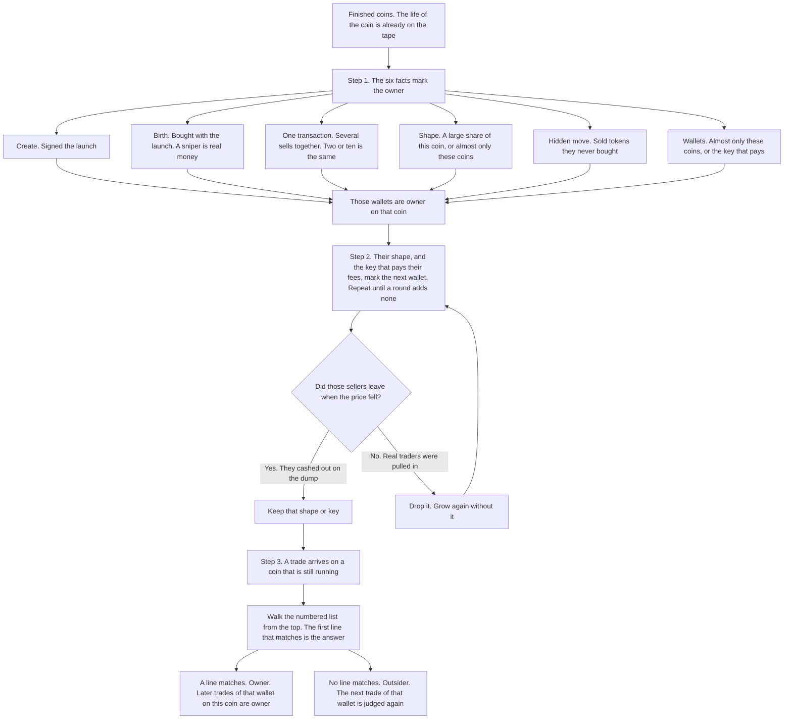

# Owner split: whose money is each trade

Every trade on a coin is **owner** or **outsider**.

- **Owner** is fake demand: the dev, the dev's wallets, and the machines the dev hires.
- **Outsider** is real money.

Owner profit, outsider buying, the dump, and the owner's decisions in
[owner-decisions.md](owner-decisions.md) stand on this split.

## At a glance

Three steps. The six facts are step 1. Rule ids on one fact are the same fact.

**1. Mark, on coins that already ended.** The whole tape is known, including the dump. Six facts
name the owner.

**2. Grow, then check.** A known owner's transaction shape, and the key that pays its fees, name
the next wallet. Repeat until a round adds no wallet. Then ask whether those sellers left when
the price fell. They cashed out: keep that shape or key. Real traders were pulled in: drop it,
and grow again without it.

**3. Tag a trade that just arrived.** The coin is still running. Walk the [numbered list](#the-numbered-list)
from the top. The first line that matches is the answer. Do not read the lines under it.

- A line matches: this trade is owner. Later trades of that wallet on this coin are owner.
- No line matches: this trade is outsider. The next trade of that wallet is judged again.

### The six facts

- **Create (A1, A2).** Signed the launch. Every wallet in that transaction is the owner.
- **Birth (A5, A3).** Bought with the launch, before anyone else can see the coin. A sniper that
  does this on many coins is real money.
- **One transaction (B, S5).** Several sells in one transaction. Two or ten is the same. Every
  wallet in it is the owner, and so are the buys they already made on this coin.
- **Shape (D, A4, S1, S2).** One transaction shape is a large share of this coin, or a script
  used almost only on this group's coins.
- **Hidden move (T1, T2, T3).** Sold tokens the wallet never bought, or only buys and never sells.
- **Wallets (W, L, S3, S4, S6).** Trades almost only these coins, fresh wallets cash out together,
  or the key that pays the fee.

## The three steps

### 1. Mark

Runs on coins whose life is already over. The dump is on the tape, so a transaction that holds
several sells is visible.

Each fact is one way the same person shows up. A wallet any fact names is the owner on that coin.
Where the fact says so, the buys that wallet already made on the coin are the owner's too.

The numbers for each fact are in [The six facts](#the-six-facts).

### 2. Grow, then check

Marking finds the first wallets. Those wallets reveal the next ones.

- They keep using one transaction shape the rest of the market hardly uses. The next wallet that
  uses it is the owner.
- One key pays their fees, and that key pays almost only on the owner's coins. Every wallet that
  key pays for is the owner.
- The new wallets reveal the next shape or key.
- Stop when a round adds no wallet.

The check asks one question about each shape or key this step added: did those sellers leave when
the price fell?

- Yes. They sold before the dump finished and little of the bag was left. Keep it.
- No. The shape or key pulled in people who held through the drop. Drop it, and grow again
  without it.

The create, the birth, the hidden move, a wallet that trades almost only these coins, and fresh
wallets cashing out together are not checked this way. They are already one person. The numbers
are in [Checks](#checks).

### 3. Tag a trade that just arrived

The coin is still running, so the dump may not have happened yet. Each trade is judged when it
lands, from what is already known: the create, the lists built from finished coins, the bag, and
the shape of this transaction.

Walk [the numbered list](#the-numbered-list) from line 1. The first line that matches decides
this trade. The lines under it are not read.

- Line 5 matches a sell whose core is two or more `Pump.Fun: SELL`. This trade is owner. Every
  wallet in that transaction is owner on this coin, and the buys they already made here are owner
  too. Stop.
- Lines 1 through 12 all miss. This trade is outsider.
- Once a wallet is owner on this coin, its later trades match line 9 and stay owner.
- A trade that matches nothing does not freeze the wallet. Its next trade walks the list again.

A birth buy is often a public `Pump.Fun: BUY`, so the list carries those wallets. The multi-sell
carries one row per pack size, so the sell matches on a wallet the list has not seen yet. That
wallet then joins the list, and its earlier buys on the coin match too.

## Words the facts use

**Trader.** The credited wallet. When that wallet is a routing wallet, a service wallet thousands
of users trade through, the trader is the fee payer. Every fact that says "wallet" reads the trader.

**Structure.** How a transaction is built.

- The **core** is the labels left once the extras are dropped: compute budget, every System Program
  instruction, token-program and token-account instructions, memo, Lighthouse. Order stays.
  Pump.fun verbs merge: Buy, BuyV2, and BuyExactSolIn are BUY; Sell and SellV2 are SELL; Create
  and Create_v2 are CREATE. An app's own instructions stay.
- The **marks** are which extras are present (CL CU limit, CP CU price, N nonce, L Lighthouse,
  M memo, S seed or created account, C account close, W wrap), never their order, plus two counts
  (T system transfers, A token-account opens).
- The **numbers** are the CU limit, the CU price, and the tip. A script keeps its core and rotates
  the rest.

**The group's coins.** Coins with the group's creation facts (create instruction list, and CU price
or `max_sol_cost`). Fixed at birth, so they never depend on the split.

**Fall.** A drop is a slot where the price falls 10% or more. A fall is one drop (a one-shot dump),
or drops less than 30 s apart (a waterfall). The main fall is the coin's deepest.

## The six facts

Each fact is the one-line version above, with the numbers.

### The create (A1, A2)

The person who launches the coin.

- The wallet that signs the create is the dev.
- Every other wallet in that same transaction is the same person.
- All of them are the owner.

### The birth (A5, A3)

Buys that land before anyone else can see the coin.

- A buy within 15 ms of the create, measured from the create's block time, is the owner. The
  instruction list does not matter.
- A buy later in the creation slot is the owner too.
- A sniper is the exception: a bot that buys the first slots of 20 or more coins over two weeks,
  from 10 or more creators, with at most 20% of them this group's. The count is over the two
  weeks, never one day.
- That sniper is real money, and stays real money on this coin.
- Buy size is not the test.

### The same transaction (B, S5)

Wallets inside one transaction are one person.

- The dump is this: one transaction contains several Pump.Fun sells.
- Two sells or ten sells is the same fact. The count does not matter.
- A SOL transfer, a compute-budget instruction, or an account close in that transaction is the
  same person. They sit outside the core, so the match is the same.
- Every wallet in the transaction is the owner on this coin.
- The buys those wallets made earlier on this coin are the owner's too.
- A wallet in one transaction with a wallet already known to be the owner is the owner too.
- A transaction with only one sell is an ordinary trade. This fact does not mark it.
- The matcher is exact on the core, so the tag holds one row for each count that shows up.

### The script's shape (D, A4, S1, S2)

The owner repeats one transaction shape. It shows up in two places.

- On one coin: a shape that is at least 20% of the trades, or 20% of the SOL, with at least 10
  trades, is the owner on that coin.
- That one-coin shape is the instruction list plus its CU price. The CU limit is left out.
  Snipers' creation-slot buys are left out of the share.
- Every wallet using that shape on that coin is the owner, including the trades it already made
  there. This reading needs no other coin.
- A shape used on 10,000 or more coins in the market is a public app, so this fact leaves it out.
- Across the market: an instruction list, fees left out, is the owner's script when 30% or more of
  its trades sit on this group's coins, on at least 5 group coins, from at least 2 creators.
- Fees are the CU limit, the CU price, and the tip. The owner changes them at will.
- Every wallet that trades with that script is the owner. One trade is enough.
- After some owner wallets are known, a shape those wallets keep using, and that the rest of the
  market hardly uses, is the same script.
- Hardly used: 80% or more of its market trades are on the owner's coins.
- Kept using: 95% or more of its trades are already owner, from 5 or more owner wallets. One extra
  wallet on under 100 coins in the month still leaves the shape owner.
- It also runs on a timer, first seen within 1 s of its usual age on 60% of its coins, or half its
  wallets already use another owner shape.
- The next wallet that uses it is the owner.
- The shape is matched at [Match levels](#match-levels), loosest first. A memo, a verb variant, or
  a fresh CU limit is still the same script.
- The script and the paying key are applied again until a round adds no wallet.

### The hidden move (T1, T2, T3)

Tokens pass between the owner's wallets with no trade on the tape.

- A wallet that sells more than it bought is the owner on that coin. The test is a sell that takes
  its bag below zero by more than 1% of the sell.
- It joins the owner list for other coins when the same thing happens on 2 or more coins.
- A wallet that buys 10 or more coins, with 20 or more buys, and never sells anywhere, is the owner
  on every coin it buys.
- The wallet that still holds, whose bag matches the seller's missing tokens within 0.5%, and is
  the only such wallet, is the wallet that handed them over.
- When the seller also bought on the coin, the missing tokens do not show, and this fact misses
  both wallets.

### Wallets that are not real traders (W, L, S3, S4, S6)

A real trader spreads over the market. The owner does not.

- A wallet on 3 or more of this group's coins, with 80% or more of its coins inside the group, is
  the owner on every coin it trades.
- A fresh wallet is on 4 or fewer coins in the whole market.
- Three or more fresh wallets that each sell their whole bag in the same slot, and never buy the
  coin again, are one person cashing out. They are the owner on that coin, including the buys they
  made earlier there.
- The key that pays the fee, when 80% or more of what it pays is on the owner's coins and it pays
  for fewer than 50 coins a day, is the owner's key.
- Every wallet that key pays for is the owner. One trade is enough.
- A wallet whose first trade ever is on the owner's coins, with an owner shape or the owner's
  paying key, and with no trade in the 14 days before, is the owner.
- A key that pays for thousands of unrelated users is a service. This fact leaves it out.
- A buying machine on fewer than 10 coins is below the test.
- A volume service that trades many devs' coins is a hired machine, so it is owner, but it trades
  too widely for the group test and its wallets are not fresh, so these tests miss it.

## Outsider

Real money, once the six facts have passed. The birth fact names the sniper. The other kinds:

- **Button buyer.** Buys a size an app offers as a button: 0.1 / 0.5 / 1 SOL after the venue fee
  (0.099, 0.494, 0.988), or a dollar button at the day's SOL price, or a size 15 or more traders
  used in the same hour.
- **Bottom-fisher.** One buy of 1-3 SOL on many coins, about 30 a day, out within minutes, ahead
  on most coins.
- **Herd bot.** Many coins a day, joins within seconds of a big buy, ends empty, market result
  around even.
- **Racer.** Pays a high priority fee to land first.

## The numbered list

This is step 3. Go down the list. The first line that matches decides this trade. Do not read the
lines under it.

| order | the trade | result | fact |
| --- | --- | --- | --- |
| 1 | from the creator, or inside the create transaction | owner | create |
| 2 | a buy in the creation slot, within 15 ms of the create | owner, and the wallet on this coin | birth |
| 3 | a creation-slot buy after that window, by a trader that is not a sniper | owner | birth |
| 4 | an owner script, on one coin or across the market | owner, even on a new wallet's first trade | script's shape |
| 5 | a sell whose core is two or more `Pump.Fun: SELL` | owner, and the wallet on this coin | same transaction |
| 6 | a sell that takes the bag on this coin below zero | owner, and its later trades on this coin | hidden move |
| 7 | a wallet on the buy-only list | owner | hidden move |
| 8 | paid for by the owner's key | owner | wallets |
| 9 | an owner wallet already found | owner | any fact that listed it |
| 10 | in one transaction with an owner wallet | owner | same transaction |
| 11 | a fresh wallet selling out in a slot where 2 or more other fresh wallets do | owner, from that sell on | wallets |
| 12 | a shape that has reached 20% of this coin's trades or SOL so far | owner, and the wallets using it on this coin | script's shape |
| 13 | anything else, snipers included | outsider | |

In the engine, a rule reads structures (lines 1, 4, 5, 10) and the bag (line 6), which the engine
already keeps per wallet. A wallet is never a term in a rule
([_!___strategy.md](_!___strategy.md) T5). Lines 2, 3, 7, 8, and 9 read lists built daily. The tag
carries line 2 as wallets, because a birth buy is often a public `Pump.Fun: BUY`, and line 5 as one
core row per pack size. Live, line 6 turns a trader owner only from its first sell below zero.

## Match levels

A script rotates small variants of one build, so the script's shape is judged at seven levels,
loosest first. A shape is owner at any level where the market tests hold, and the loosest passing
level catches every variant.

| level | the trade matches when it has the same |
| --- | --- |
| 1 | core and side |
| 2 | core, side, and marks |
| 3 | core, side, and CU price |
| 4 | core, side, and tip |
| 5 | core, side, CU price, and tip |
| 6 | core, side, marks, CU price, and tip |
| 7 | exact instruction list, CU limit, CU price, and tip |

A private program passes at level 1. A public app passes only at a level that carries the owner's
own fee, or never. The volume list holds level 7 as an exact instruction-list row, and levels 1-6
as a core row: the core's labels, the side, and whichever of marks, CU price, and tip that level
pins. A pin the trade lacks is left off, so that row matches any value there.

## Checks

This is the question in step 2. These do not mark a trade. They drop a script or a paying key that
pulled in the wrong wallets.
The create, the birth, the hidden move, the group wallet, and the fresh-wallet cash-out are not
judged here. A set is one shape, one paying key, or all the wallets one rule added.

Only the seller is judged by how it exits. A buyer that never sells is judged by the hidden move.
A set that trades both ways and ends empty is judged at the shape or the key that brought it in.

| check | stays when | what it reads |
| --- | --- | --- |
| C1 | 40% or less of its sold tokens are late. A set with no sells passes | a sold token is late when sold after the main fall begins, except a sell while that drop had fallen less than half its way |
| C2 | at the end of the main fall, 10% or less of its biggest bag before the fall | the owner has cashed out |

A set stays when C1 and C2 both pass on 60% or more of its coins with a fall, over at least 5
coins. Fewer coins, and the set stays untested. Tune the two so the creator passes and a wide bot
that wins fails: a wallet on 100 or more coins, net SOL above zero, behind on fewer than half its
coins, that never used the owner's program and never created a coin. Snipers are not judged here.

The six facts hold for every chart shape. C1, C2, and the verify checks below are retuned per shape.

| shape | the fall | C1 and C2 |
| --- | --- | --- |
| steady rise, one-shot dump | the one dump | on the main fall |
| waterfall | the drops less than 30 s apart, read as one fall | C1 on every step; C2 at the bottom |
| many swings | each fall | C1 on every fall; C2 only on the last, since the owner may buy again |
| slow bleed, no dump | none | untested; the set stays on the facts alone |
| heavy outside trading | as above | each group sets its own values from the coins that pass |

| check | good when |
| --- | --- |
| V1 owner money, per coin, bags included | the owner ends behind the outsiders on 30% of coins or fewer, and its usual loss is 10% of its money or less |
| V2 share of price movement from owner trades | 80% or more |
| V3 share of seconds where outsiders move 0.5 SOL or more | 20% or less. Money, not the presence of a tiny trade |
| V4 share of outsider SOL in their busiest 10% of seconds | 50% or more |
| V5 an outsider wallet or shape trading like a script, 10 or more 3 s windows in a row | none. Each one found is reviewed as a missed owner |
| V6 eye check, price and both flows on one axis | the owner line has the chart's shape. A stretch where the outsider line follows the chart is a real swing when the owner does not sell into it and the tokens sold there were bought there |
| V7 the lists, used on the 2 weeks before | they still find the owner, and less than 2% of outsider money is marked owner |
| V8 shuffle who traded inside each coin, keep the times | the fact finds far more on the real tape |

V1 reads the owner side as a whole. A buyer wallet loses while a seller wallet collects. Rebuild
every day from the last two weeks: wallets change fast, shapes and paying keys slowly.

A fresh wallet on a public app, at that app's default fee, that buys once and sells what it bought,
matches none of the six facts.

## Appendix A - tested and not used

| idea | what it is | why not |
| --- | --- | --- |
| hand-off | an owner wallet sells tokens and this wallet buys the same amount (within 5 %) within 3 s, 3 or more times | luck: 81 wallets on the real tape, 73-81 on shuffled tapes |
| one transaction buys and sells the coin | a wash inside one transaction | its wallets fail C1-C2 as a set (10 % / 50 % of coins) |
| mirror | in one slot an owner wallet buys and this wallet sells about the same SOL, 3 or more times | fails C1-C2 as a set (50 %) and pulls in wide bots on old days |
| acts together with an owner wallet | always a fixed time after an owner wallet, or in the same slot, on 5 or more coins, 10 or more times chance | real coordination, but followers: pass C1-C2 as a set on 28-32 % of coins against 66 % for the crew's wallets. Two outsiders in exact lockstep with each other are M2, a different test |
| trades only the owner's coins | 80 % or more of its market coins are the owner's | followers again: pass on 15 % of coins |
| loses in the market, alone | 10 or more coins, ends empty, behind on most, but no bundle and no lockstep partner | real herd bots look the same: it marks 13 % of a real herd's money |
| a bundle operator focused on the owner's coins | 3 % or more of its coins are the owner's (10 times the market rate) | a paid service works many devs, so its focus on one is low (1 % for 9eLn's service); loss is the test |
| a machine judged one wallet at a time | each wallet's own market result | one operator's wallets win and lose by turns: 4 Terminal sister wallets came out 2 owner, 2 outsider |
| operators joined by any shared bundle or lockstep | link two wallets whenever they meet in a machine, or meet on 2 or more coins | strangers who trade thousands of coins meet by chance and chain into one group of 300-900 wallets; on old days 58 % of the winning-bot reference was marked owner |
| one loser decides the group | the group's summed result over a group of strangers | one wallet at -377 SOL turns 297 wallets owner |
| loses in one half only | combined net below zero in the last two weeks | real bots have bad fortnights: on old coins the recent lists then mark 7.4 % of outsider money owner, 650 SOL of it from wallets that won there |
| loses in both halves | combined net below zero in each two-week half | too strict: a machine that rode one good fortnight escapes (on 9eLn 81 SOL, 23 % of the coin) |
| sister by coin list alone | a wallet whose market coins match an owner operator's wallet, with no shared bundle or lockstep | a service does not keep its wallets on one coin list: 2-5 wallets found in a window |
| per-coin structure share | on one coin, a build whose money is 80 %+ owner makes its other trades there owner | 0.1 % of all money; on 9eLn 42 % to 44 % |
| the machines' client list | a wallet whose market coins are mostly coins the losing machines also work | the machines touch about 40,000 coins, every active one: winning bots score as high as the owner |
| pool wallet: shares coins with this coin's machines (20x chance or more) and loses over the month | per coin | sweeps in 6,576 wallets that look like retail (7.5 coins a day, 0.08 SOL buys, 25 % button sizes, daily sleep of 8 h); they lose 217 SOL on the crew's coins, and the outsiders' typical loss halves. Volume makes coins trend and retail chases trending coins, so retail shares the machines' coins too |
| trades while the coin is quiet | a trade far from other trades and price moves | on a busy coin there is no quiet: on 9eLn every group trades 0.1-0.4 s after another trader |
| a buy after 2 or more empty slots | a buy that reacts to no print (a bot reacts 1-2 slots after one), so the dev buys to wake the coin | people click 1-5 s after the chart moves, and many bots fire on age or market cap: 27 % of small wallets' buys land after 2+ empty slots, against 34 % of the 9ddjzq program's; 78 % of quiet buys are owner against 75 % of all buys |
| restart kick | a buy after 2+ empty slots at a bottom (price 30 %+ under the coin's high so far), after the owner has sold | at a bottom a quiet buy is owner as often as any buy (25 % against 26 %); the outsider kickers are 1,192 wallets, 31 of them on 3 or more coins |
| build loyalty with fees in the key | A4 on the exact structure (ix list + CU price + tip, with or without the CU limit) | 7ix with `9ddjzq` hidden, at 30 %: marks 6.1 % (exact) and 10.3 % (CU limit free) of outsider money, against 0.00 % for the ix list alone: fee variants of plain builds mix in public users |
| build loyalty at 80 % | A4 with 80 % of the build's market trades on the group's coins | 7ix with `9ddjzq` hidden: finds 1-15 % of owner SOL, against 86 % at 30 %; the crew program also works coins of other launch builds (706 coins, 418 of them 7ix). Between 20 % and 50 % the result is flat |
| a buy in slot +1 by a non-sniper | the creation slot widened by one: apps show a coin only from slot +2 (app buyers among non-snipers: 1 % in slot 0, 9 % in slot +1, 24 % in slot +2) | adds 0 SOL on 7ix (the crew's bundle sits in slot 0); on 5ix those buyers pass C1-C2 on 31 % of coins: outsiders |
| sniper breadth counted per day | A3 with 20 coins and 10 creators that day | a sniper with quiet days passes as owner: on 5ix 16 winning wide bots, 19 % of their money marked owner, against 1.4 % with breadth over the window |
| losing machine operators as owner (M1-M3) | a machine sign (a bundle of 3+ wallets in one slot and app, or a lockstep pair), sister wallets trading the same market coins joined into one operator, and the operator below zero over the market: owner | the wallets it adds lose to the owner on the group's coins, so they are its prey: on 3ix 0.54 they put in 2,125 SOL net while the creation crew takes out 1,887, and they buy late (median slot +314 .. +523); on 7ix they end -349 SOL (bags counted) while the owner ends +3,344. On a group whose builds are all public, 3 wallets in one slot through one app is any crowd |
| heavy loser on wide breadth | a wallet on 20+ market coins losing 1 SOL or more a coin: a paid volume service | adds 27 SOL on 3ix 0.54; on 5ix it adds 262 SOL, of which the known owner holds only 28 % |
| build loyalty on the family | A4 against every coin with the group's create instruction list (all `max_sol_cost` or CU price slices), 20 times chance | finds the 3ix 0.54 owner's buy script (49 % of its trades on the family, 9 % on the slice) but assumes one family is one owner; the same create list carries several owners split by CU limit, CU price, `max_sol_cost` or spendable SOL. D finds the same script on each coin it dominates (3ix owner 93.8 % against 94.3 %) |
| D on the bare instruction list, or at 10 % | the pattern without its CU price, or a 10 % share | at 10 % it takes 1.9-3.5 % of the winning wide bots' money on 5ix and 7ix; without the CU price, plain public builds dominate small coins |
| a tag of exact lists only | the owner tag holds whole instruction lists (with a CU price pin where needed) | on new 5ix coins it catches 84.0 % of owner SOL with 2,952 rows; core and exact rows catch 88.2 % with 663 ("How a split becomes a tag") |
| wallet loyalty at 30 % | W with 30 % of the wallet's market coins in the group | on 5ix the split's outsiders hold 40 such wallets with 41 SOL (0.03 % of the volume), small losers; W at 80 % keeps the owner and leaves them |
| C1 as "most sells land inside drops" | | volume wallets sell all through the coin's life; the crew's own wallets meet it on 24 % of coins |
| C1-C2 on one wallet | | 54 % of the crew's own program wallets fail alone |
| V3 counting presence | seconds in which outsiders trade at all | tiny retail trades fill half the seconds |
| any of these alone | the app used, equal amounts, equal fees, back-to-back landing, one shared bundle, lockstep, a shared service payer | other bot groups and copy traders do all of these. A bundle or lockstep is owner only with a steady loss (M1, M2) |

**A human sleeps.** Over two weeks, people leave a daily gap of several hours with no trade; trading
bots do not. Median daily silence: 9eLn's plain-Axiom outsiders 7 h, retail swept by the pool idea
8 h; winning bots 2 h, the Eu8n herd 3 h, multi-wallet traders 0 h. Paid machines rotate wallets
across the day, so their single wallets sleep too (median 6 h): silence tells a person from a bot,
but not a paid machine from a person.

"Chance": how often two unrelated wallets meet by luck. With 1,000 coins, wallet A on 50 and wallet
B on 40 meet on about 50 x 40 / 1,000 = 2 coins. Meeting on 35 is not luck, but copy bots that follow
the owner meet it on 35 too. Beating chance proves coordination, not ownership.

---

## Appendix B - measured

On 7ix, built on 09-15 .. 10-01, checked on 09-02 .. 14:

| what | result |
| --- | --- |
| the split | 1,333 coins (the old instruction list on any day, the new one with CU price 1000 from 09-28); owner 93.6 % of SOL; owner ahead on 97 % of coins; V2 passes on 82 % of coins (median 94 %); V3 median 1.6 % of seconds |
| old days (V7) | owner 93.1 % against 94.2 % for a split built there; 1.77 % of outsider money marked owner (186 SOL) |
| outsider reference | wide bots that win over the month marked owner on 1.1-2.1 % of their money, none of it by M |
| calibration of C1-C2, judged as sets | crew program wallets 66 %, creators 90 %, creation-slot owner buys 70 %; snipers 44 %, wide bots 4 %; T1 wallets 35-45 % (they sell all through the coin's life, so T sets are never judged by C) |
| match levels (S1) | a list of exact structures built on one half of the month finds 81 % of owner SOL on the other half one way and 53 % the other; the core with all 7 levels finds 93 % and 89 %, adding 0.00-0.05 % of outsider money. The crew program rotates up to 201-549 exact variants of one core. Owner structures passing on 09-15 .. 10-01: level 1: 6, level 2: 16, level 3: 135, level 4: 12, level 5: 272, level 6: 367, exact: 448 |
| few structures carry the owner | 372 instruction lists; the top 10 carry 83 % of its SOL; 161 used only by the owner carry 95 % |
| structures outlive wallets | the 09-01 .. 14 structures bring in 859 unseen wallets on 09-15 .. 27 (16,000 SOL) and 0.4 % outsider money |
| a wallet has a few jobs | an owner wallet uses 3 structures (median; 8 at p90); its main one covers 59 % of its trades |
| fee settings expose plain trades | 39 plain Pump.Fun structures with a particular CU price are mostly owner: 2,776 SOL |
| transfers (T1) | wallets selling more than they bought move 6.2-6.3 % of all SOL; 88-95 % already owner by other rules; the rest (550-1,000 SOL) is the crew's plain sell script at new CU prices |
| buying machines (T2) | 283 market wallets buy 10 or more coins and never sell (28,600 SOL in two weeks); 30-39 trade the crew's coins (94-200 SOL there) |
| transfer pairs (T3) | a shortfall finds a matching holder on the same coin 21-35 % of the time; on a random other coin 1.5-1.9 % |
| machine operators (M) | 09-15 .. 10-01: 1,599 operators with a machine sign; 1,138 lose steadily (1,263 wallets), 461 do not and stay outsiders |
| sister wallets (M2) | of 5,947 machine-linked pairs, 1,596 trade 80 % or more of the same market coins |
| test coin 9eLn (09-25) | M moves its owner share from 9 % to 42 %. The Axiom money left outsider (81 wallets, 74 SOL) looks like app users: button sizes (median 0.20 SOL), first buy at 52 s (owner Axiom wallets: 0.78 SOL at 30 s), 2 trades, about 14 coins a day, -0.02 SOL a coin, 15 % with a machine sign |
| test coin Eu8n, second swing (09-20, age 146-568 s) | two outsiders buy 7.9 and 3.0 SOL at the bottom, 58 bots follow within a minute, the owner sells 1.3 SOL; M marks 6 % of it owner: a real swing |
| test coin 9wyA (09-24) | 4 Terminal sister wallets (+12.5 SOL together) and two early flip bots (+236 and +485 SOL on 6,055 and 8,853 coins) stay outsiders |
| test coin FohR (09-28, old instruction list) | outside the coin set until the list filter took the old list on every day; now 94.7 % owner. Wallet 4CPn (one coin in the month) is owner through its fee setting (S1 level 3 with one narrow wallet) |
| test coin 2FW3 (09-20) | two sniper operators at slot +2 (3 wallets, +575 SOL; 5 wallets, +311 SOL) stay outsiders |
| money per coin (09-01 .. 14, earlier split) | crew wallets +3.81 SOL median, ahead on 69 %; creator +0.74, ahead on 99 %; one crew group -4.44 a coin (its job is buying) |
| wallets go stale | wallet groups from 09-01 .. 14 carry 50-66 % of the crew program's SOL on most later days, 35-36 % on 09-25 and 09-27 |

**A4 on a group with no known program.** Coins born 09-17 .. 30, market facts from every trade of
those days. "Answer-key owner" is the owner named without the split: on 7ix the full split built
with `9ddjzq`; on 5ix (`Create_v2, ATA CreateIdempotent, BuyV2` at CU price 6,666,666, 2,313 coins,
150,248 SOL) the traders of sell transactions carrying 2 or more wallets, on 2 or more coins, plus
the creator and the create transaction.

| what | 7ix, `9ddjzq` hidden | 5ix |
| --- | ---: | ---: |
| answer-key owner SOL found by MARK without A4 | 17 % | 56 % |
| ... with A4 | 86-92 % | 90 % (the answer-key wallets' buys: 49 % -> 96 %) |
| ... after GROW without A4 | 23 % | 100 % (through S3-S5) |
| ... final split without A4, one-key links judged by C1-C2 | 23 % | 59 % |
| ... final split with A4, one-key links judged at the source | 99.8 % | 100 % |
| outsider money A4 marks | 0.00 % (7ix answer key) | 0.00 % of the winning wide bots' money |
| winning wide bots' money in the final split (sniper breadth over the window) | 3.0 % (the answer key: 4.1 %) | 1.4 % |
| A4 built on one week, used on the other | 86 %, 0 SOL outsider | |
| owner instruction lists found | 22 (19 carry `9ddjzq`, one is the create transaction) | 41 programs, 40 plain lists |
| final split: owner ahead of outsiders / V2 median / V2 >= 80 % | | 99 % of coins / 0.95 / 92 % of coins (without A4: 98 % / 0.70 / 34 %) |

**How a split becomes a tag.** One build serves every group. Every structure of the group's trades
is read at each match level (core levels 1-6, the exact list alone, the exact list with its CU price,
level 7), and a row passes when it is 90 % or more owner SOL on the group, has 10 or more trades
there and runs on fewer than 10,000 market coins. The tag holds the fewest passing rows that still
cover every trade the passing rows cover (biggest row first), the creator, and the owner wallets
with an owner trade before their first trade a row catches (sticky). A row applies on every coin of
the fingerprint, while D reads one coin, so the tag can carry some outsider money the split leaves
out.

| fingerprint (tag) | rows (core / exact) | wallets | agrees with the split on SOL | coins within 5 points | rows alone carry |
| --- | ---: | ---: | ---: | ---: | ---: |
| 7ix, both create lists, 224 coins (`volume` and `owner`) | 54 / 5 | 170 | 99.8 % | 99 % | 99.3 % of owner SOL |
| `5ix owner split` (`volume`) | 1,159 / 53 | 13,631 | 99.6 % | 99 % | 90.0 % |
| `3ix 0.54 owner split` (`volume`) | 11 / 7 | 127 | 99.3 % | 91 % | 98.4 % |

**Core rows reach new coins.** Rows chosen on the first 60 % of a group's coins by birth and read on
the other 40 %:

| group | rows | owner SOL caught on the new coins | outsider SOL caught | rows needed |
| --- | --- | ---: | ---: | ---: |
| 5ix | exact lists only | 84.0 % | 1.6 % | 2,952 |
| 5ix | core and exact | 88.2 % | 2.6 % | 663 |
| 7ix | exact lists only | 98.2 % | 0.0 % | 49 |
| 7ix | core and exact | 98.2 % | 0.1 % | 38 |
| 3ix 0.54 | either | 98.0 % | 25.8 % | 16-17 |

Core rows alone, without the exact levels, catch less (5ix 85.1 %, 7ix 95.0 %): some owner builds
pass only as one exact list. The owner bar (80-95 %) moves none of these by more than half a point.
A wallet list adds under one point on new coins, since the owner's wallets rotate. On 3ix 0.54 the
outsider SOL caught is the owner's own buy script (CU price 950,000, 664 market coins) on coins where
it stays under D's 20 %; the split leaves those trades outsider. On 7ix the exact row `ATA Create,
Pump.Fun Buy` (no CU instructions, 229 market coins, 84 creation-slot buys of 1,038 SOL, all owner)
catches the owner's creation-slot bundle buy on a new coin before any wallet list knows the wallet.

With W and L in place of M1-M3 the 5ix split
keeps 100 % of the answer key, and the owner share moves from 91.7 % to 90.5 %; D adds 4 SOL.

The 5ix outsiders are 9.5 % of the SOL (median coin 5.1 %, 81 % of coins under 10 %). They are wide
traders: 64 % of their SOL comes from wallets on 100 or more market coins in two weeks, and wallets
seen on one coin only carry 84 SOL. The largest unknown program among them, `6Vo3245e`, is
a public app (115,735 coins, 101,397 wallets, 0.4 % of its trades on 5ix). Measured the way the
chart reads the tag, a median coin has 5 % outsider SOL on 5ix against 7 % on 7ix.

A tag reads forward: sticky marks a wallet's trades only from its first tagged trade on. The split
labels the wallet's whole history on the coin. So the wallet list holds every owner wallet with an
owner trade before the first trade a build matcher catches, including the birth-bundle wallets,
whose buy core is often a public `Pump.Fun: BUY`. The exit burst is on the shape list, one core
row per pack size, so the sell matches on a wallet the list has not seen; that wallet is on the
list as well, so its earlier buys match. A wallet the list leaves out keeps those trades on the
outsider side while its later sells go to the owner.

On `Ad8zvok8gZebkyLYCWP63Jj9xeopiVTR5773Tndwpump` the birth-bundle wallets buy in the creation
slot and sell in the 12-sell burst at 19:21:36. The buys and the burst are volume. A single-wallet
app sell in that same second stays outside the burst, and a sniper later in the creation slot
stays outside the birth bundle. On
`4u5L6sfpur3PreYvirLxJiKbuBaqFtGcmS6G7tXMpump` the three plain buys beside the create are volume
through the wallet list, and the slot-+242 dump is volume through the 12-sell core.

**The stored tag, coins born 09-15 .. 10-01.** `5ix owner split` holds 816 core rows, including
one pure `Pump.Fun: SELL` core for every pack size from 2 to 12 (size 1 stays pinned to its CU
price), and 17,677 wallets, 4,046 of them the birth bundle. `3ix 0.54 owner split` holds 222
wallets, 95 of them the birth bundle, and no pack-size row. On 7ix the tag holds 13 rows plus a `dump` tag. Birth-bundle wallets on top of the shared 170 are 12, 28, 14,
40, 0, 4, 2, 28, 0 and 20 across the five max-cost bands, new list then old list.
3ix and 7ix dumps are a pinned single sell and, on 7ix, the `9ddjzq` dump instructions.

**3ix 0.54: a group whose builds are all public.** 3ix:Buy (`Create_v2, ATA CreateIdempotent,
Buy`, no CU instructions) with `max_sol_cost` 0.54 SOL: 80 coins born 09-17 .. 30, 13,618 SOL,
median coin 78 SOL, 36 % of coins rise with no real drop and fall in one slot. The groups with
`max_sol_cost` under 0.054 SOL are not tradable: someone buys the whole curve in the creation slot.

| what | M1-M3, no D, W, L | no M1-M3, D, W, L | + W and L | + D (final) |
| --- | ---: | ---: | ---: | ---: |
| owner share of SOL | 92.3 % | 50.7 % | 90.5 % | 93.8 % |
| owner ahead of outsiders (V1) | 93.8 % of coins | 90.0 % | 95.0 % | 95.0 % |
| V2 median / coins >= 80 % | 0.94 / 85 % | 0.75 / 44 % | 0.92 / 79 % | 0.93 / 89 % |

D finds 81 dominant (coin, pattern) pairs; the main one is the owner's buy script (`CU Price,
CU Limit, ATA CreateIdempotent, Buy` at CU price 950,000, on 664 market coins, 4,077 SOL here).
Read as the chart reads it, a median coin has 5.2 % outsider SOL (75 % of
coins at or under 8.3 %, the highest 31 %), against 7 % on 7ix and 5 % on 5ix. The tape carries
curve trades only, so a coin's life after migration (35 coins, all pushed there by the W wallets)
is not in any of these numbers.

On 7ix (the 162 coins of the exact create list born 09-17 .. 30) the same method gives owner
74.7 % of SOL (69.1 % without D, 81.8 % with M1-M3), owner ahead on 95.1 % of coins, V2 median
0.85; D adds the `9ddjzq` lists A4 misses on this coin set (980 SOL).

On 6ix: one network of 2,136 wallets trades 84 % of all 6ix coins and makes 58 % of their volume;
107 creators are its own wallets. It ends about even (-0.01 SOL a coin); the creator is ahead on
83 % of coins, outsiders on 9 %.

On the whole market, 09-26 (28,819 coins created):

| what | result |
| --- | --- |
| creation-slot money | creators buy 80,861 SOL; other transactions in the creation slot 77,772 SOL (55,787 buys on 15,627 coins) |
| snipers in it | buyers on more than 50 coins that day make 34,135 of those buys (33,707 SOL, median 0.62 SOL); buyers on 50 or fewer make 21,724 (44,132 SOL, median 1.3-1.4 SOL) |
| payers | 234,149 trades paid by another account; three service payers pay on 3,405-4,999 coins each; 3,678 payers pay for 6-20 wallets on a median of 1 coin (one operator each) |
